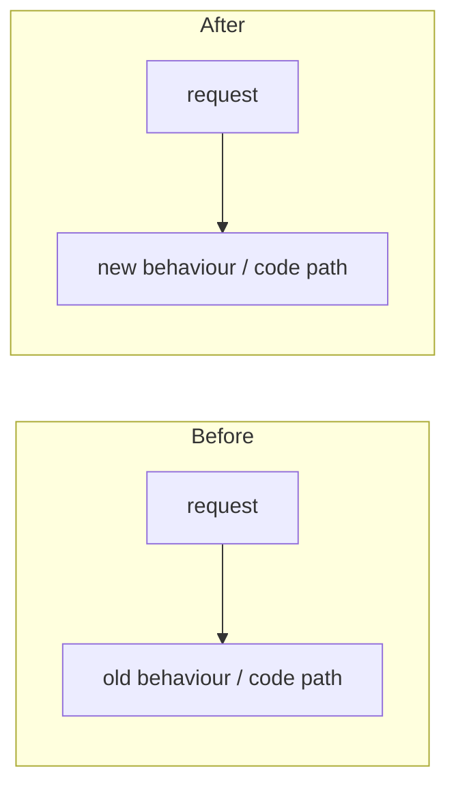

# Darkbloom docs — how this documentation is organised and maintained

> Last updated: 2026-09-11 · commit `156843b35`

Rules for anyone — human or agent — who reads, writes, or checks a file under
`docs/`. The code is the source of truth; a doc that disagrees with the code is
a bug in the doc. Read this page before editing docs; read
[`README.md`](README.md) to find a doc.

## 1. The system in one table

Every page has exactly one job, chosen from a closed set. The set is the
[Diátaxis](https://diataxis.fr/compass/) compass (does the page inform *action*
or *cognition*; does it serve *acquiring* a skill or *applying* one) plus two
record types that engineering repos need and Diátaxis does not name.

| Directory | Type | Reader's question | Form |
|---|---|---|---|
| `consumer/`, `provider/`, `developer/` | how-to (action · application) | "How do I do X?" | Prerequisites → numbered steps → verify → troubleshoot |
| `operations/` | runbook (action · application, prod-touching) | "How do I operate X safely?" | Scope → prerequisites → steps → verification → rollback |
| `reference/` | reference (cognition · application) | "What exactly is X?" | Tables and schemas; one lede sentence per section; every row cites code |
| `architecture/` | explanation (cognition · acquisition) | "How and why does X work?" | Context → mechanism → invariants → failure modes → code map |
| `design/` | design record | "What was decided about X, and is it built?" | Status line + frozen body |
| `reports/` | dated record (incident, measurement, review) | "What happened / what did we measure on date D?" | Frozen; never edited after landing |
| `releases/` | release notes | "What changed in version V?" | Frozen |
| `legal/` | policy text | — | As published |
| `assets/` | diagrams, CSVs, images referenced by docs | — | — |

Apply the compass at the sentence level too: a how-to that starts explaining
*why* has drifted; move the why to `architecture/` and link.

The audience directories hold how-tos first, but a reference or explanation
page that only that audience reads lives beside them rather than in
`reference/` or `architecture/`: `provider/cli-reference.md`,
`provider/hardware-requirements.md` and `consumer/models.md` are reference
pages; `consumer/privacy-expectations.md` is an explanation. Such a page names
its type in the lede and follows the skeleton of that type (§3), not the how-to
skeleton.

## 2. Principles (and where they come from)

1. **One mode per page.** Mixed pages fail every reader: the operator wants
   steps, the reviewer wants invariants, the SDK user wants a table. Split
   rather than blend. — Diátaxis; *Software Engineering at Google* ch. 10
   ("a document should have a singular purpose").
2. **Every page is page one.** Readers arrive by search, grep, or a link, not
   by reading in order. Each page: states its context in the first three lines,
   assumes a qualified reader, stays on one level of abstraction, has no
   "previous/next" dependency, and links richly to neighbours. — Mark Baker,
   *Every Page is Page One* (seven principles).
3. **Conclusion first.** The lede answers *what is this, who is it for, what
   will I be able to do*. Details descend from there. Reference tables put the
   most-used columns left. — Minto, *The Pyramid Principle*; BLUF.
4. **Strong information scent.** File names, headings, and link text must
   predict the content precisely enough that a reader (or an agent running
   `grep`) picks the right page on the first try. Index pages are traffic
   cops: links plus one-line descriptions, no content of their own. — Pirolli &
   Card, *Information Foraging*; SWE at Google ("landing pages").
5. **Chunk, label, and be consistent.** Groups of at most nine items; every
   block labelled; the same thing called the same name everywhere (see
   [`glossary.md`](glossary.md)). Tables beat prose for anything with more
   than two attributes. — Horn, *Information Mapping*.
6. **Two levels of disclosure, no split attention.** `README.md` → page. A
   fact a reader needs for one task lives in one place; do not make them
   assemble it from three pages. — Nielsen, *Progressive Disclosure*; Sweller,
   cognitive-load theory (split-attention effect).
7. **Compress: one canonical home per fact.** State a fact once, in the page
   whose type owns it, and link from everywhere else. Restating drifts;
   linking does not. The owner is the `reference/` page that covers the fact,
   or, when none does, the `architecture/` page that owns the mechanism. A
   how-to or runbook may repeat a value in a prerequisite or step the reader
   must act on ("requires macOS 26") and then links the owner in the same
   sentence; other pages name the identifier and link, never the value. The
   privacy model lives in
   [`architecture/security/encryption.md`](architecture/security/encryption.md)
   and nowhere else. Delete superseded text instead of caveating it. Where code
   says it better, cite the code instead of paraphrasing it.
8. **Docs are code.** Under version control, reviewed with the code they
   describe, linted in CI (`make docs-check`), stamped with a freshness date and
   the commit they were verified against, and deprecated on purpose — never
   abandoned. The owner of a doc is whoever changes the code it describes. —
   SWE at Google ch. 10 (freshness dates, canonical docs, deprecation).
9. **Write for agents as well as people.** Agents forage with `grep`/`glob`
   and read a page in isolation. Use stable, grep-able identifiers (exact env
   var names, message `type` strings, function names, file paths); keep closed
   vocabularies closed; put every fact in text, never only in an image; keep
   pages short enough to fit in one read. — Anthropic, *Effective context
   engineering for AI agents* (progressive disclosure, "right altitude");
   [llms.txt](https://llmstxt.org/) (small map, links to detail).

## 3. Page skeletons

All pages start with `# Title`, the freshness stamp, and a one-to-three
sentence lede (principle 3). Then, by type:

| Type | Sections, in order |
|---|---|
| how-to | Prerequisites · Steps (numbered; one user action per step; commands in fenced blocks; system side-effects described in prose under the step) · Verify · Troubleshooting (optional) · Related |
| runbook | When to use · Prerequisites (access, approvals — production mutations need explicit human approval) · Steps · Verification · Rollback · Related |
| reference | Tables. Columns cite code (`path`, `Symbol`). Closed enums list every value. Defaults are the code's defaults, quoted |
| explanation | Context (why it exists, what problem) · Mechanism (how; a Mermaid diagram when there is flow or state) · Invariants (numbered; each cites the code that enforces it) · Failure modes · Code map (concern → file/symbol) · Related |
| design | Status line: `Status: Proposed | In progress | Implemented (vX.Y.Z) | Superseded by <link> | Abandoned` and date. Body frozen except the status line |
| report | Frozen. Stamp reflects the report's own date (`scripts/docs-stamp.sh --from-git`) |

## 4. Citing code

- Cite `path/to/file.ext` plus the symbol: `coordinator/registry/scheduler.go`
  (`selectCandidate`). Both are grep-able and the path is verified by
  `docs-check`.
- **No line numbers** outside `reports/` and `releases/`. Lines rot within
  days; symbols survive refactors and are searchable.
- Quote constants and defaults exactly as the code spells them
  (`challengeFreshnessMaxAge = 16 * time.Minute`), not rounded.
- Environment variables, message `type` strings, HTTP paths, and CLI flags are
  always in backticks and spelled exactly.
- A claim you cannot tie to code is either a design intention (put it in
  `design/` with a status) or an inference (mark it `[INFERENCE]`); it is not
  architecture.

## 5. Freshness stamp

Line 3 of every doc:

```
> Last updated: YYYY-MM-DD · commit `<short sha>`
```

- *Last updated* is the day the content was last written or re-verified
  against the code, not the day the file was touched by a rename.
- *commit* is the repository commit the claims were checked against.
- Update it whenever you change a doc's content: `make docs-stamp
  FILES="docs/path.md"` (today + HEAD). For frozen records use
  `scripts/docs-stamp.sh --from-git <file>`.
- A doc whose stamp is older than the code it cites is suspect; re-verify and
  restamp rather than trusting it.

## 6. Checks (`make docs-check`, CI job "Docs Lint")

`scripts/docs-check.sh` fails on: a missing stamp; a relative link to a
missing file; an inline-code citation of a repo path that does not exist
(exempt: `reports/`, `releases/`, `design/`); an orphan page that no other
doc links to; and a SIP-immutability claim in `README.md`,
`docs/threat-model.yaml` or `docs/provider/hardware-requirements.md` that drops
the "unpatched kernel" qualifier (TB-003). Run it before opening a PR that touches `docs/`. It checks only
git-tracked files by default; `--all` includes untracked drafts.

## 7. When you change code, change these docs

| Code change | Doc(s) that must move in the same PR |
|---|---|
| HTTP route, header, status code, JSON shape (`coordinator/api/`) | `reference/api-contracts.md`; the relevant `consumer/` how-to |
| WebSocket message or field (`coordinator/protocol/messages.go` ↔ `provider-swift/Sources/ProviderCore/Protocol/`) | `reference/protocol-messages.md` |
| Telemetry wire type or allowlist (Go / Swift / TS mirrors) | `reference/telemetry-schema.md`, `architecture/telemetry.md` |
| Coordinator env var or config default | `reference/configuration.md`; `operations/coordinator-deploy.md` if prod sets it |
| Provider CLI command, flag, env var | `provider/cli-reference.md`; `reference/configuration.md` |
| Routing / admission / scheduling constant or gate | `architecture/routing.md` or `architecture/scheduling.md` |
| Trust level, attestation, enrollment, encryption | `architecture/security/*.md`; `provider/attestation.md`; `consumer/verification.md`; `threat-model.yaml` |
| Pricing, ledger, payouts, referral | `architecture/billing.md`, `reference/pricing-model.md`, `consumer/billing.md` |
| Store schema / migration | `architecture/storage.md` |
| Provider version bump (`ProviderCore.version` ↔ `LatestProviderVersion`) | `operations/provider-release.md`; `CHANGELOG.md` |
| Build, test, CI, or script | `developer/build.md`, `developer/test.md`; `operations/` runbook that invokes it |
| New model family or engine capability | `architecture/inference.md`, `consumer/models.md`, `provider/hardware-requirements.md` |
| Anything user-visible | `CHANGELOG.md` |

## 8. Adding, moving, retiring pages

- New page: pick the directory by type (§1), add it to that directory's
  `README.md` index with a one-line description, stamp it, run the check.
- Move: `git mv`, fix every inbound link (`grep -rn "old-name.md" docs
  README.md CONTRIBUTING.md`), keep the stamp.
- Retire: delete it. Do not leave a stub. If the information moved, fix the
  inbound links to the new home. Frozen records (`reports/`, `releases/`,
  `design/` with a final status) are the only pages that outlive the code they
  describe.
- Plans that ship become explanation: fold the as-built facts into
  `architecture/`, set the design doc's status to `Implemented` (or
  `Superseded by`), and stop editing it.

## 9. Pull requests

Every PR description includes a **before-and-after Mermaid diagram** covering
both the observable behaviour (request/response flow, states, outcomes) and
the code path (which functions/components changed and how control flows).
Scope it to the PR's delta. A PR without it is not ready for review. Docs-only
PRs diagram the navigation delta (which pages moved, split, or were removed).



## 10. Voice

Plain, declarative, present tense. Say what the code does, not what it "aims
to" do. No marketing phrases: "the coordinator never sees plaintext" is false
under the hop-by-hop model and must not appear; link to
[`architecture/security/encryption.md`](architecture/security/encryption.md)
instead. Prefer a table to a paragraph, a number to an adjective, and a
citation to a description.
