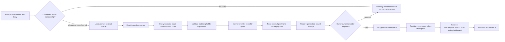

# Exact Prefix Cache Routing

> Last updated: 2026-09-10 · commit `05f987729`

Exact prefix cache routing lets the scheduler prefer a provider that has
*proven* it holds a reusable exact token prefix in an advertised resident
memory or encrypted SSD cache. This page explains the mechanism — proof, evidence lifecycle,
service cost — and the guarantees that bound it; it is for engineers changing the
scheduler, the receipt path or the prompt-contract sidecar. The operator
procedure for turning it on is
[`../operations/cache-routing-rollout.md`](../operations/cache-routing-rollout.md).

## Context

A provider that already holds a request's exact token prefix in its local
prefix cache ([`prefix-cache.md`](prefix-cache.md)) can skip that prefill,
but the scheduler's cost model ([`routing.md`](routing.md#cost-model)) knows
nothing about where a prefix lives. Cache-aware routing closes that gap by
pricing a *proven* cache hit at the provider's estimated residual prefill plus
restore cost — never as a hard affinity, and never on the strength of a
caller-supplied field. It is flag-gated:
[`EIGENINFERENCE_CACHE_ROUTING_MODE`](../reference/configuration.md#routing-admission-and-ttft)
defaults to `off` (`CacheRoutingOff`, `coordinator/registry/cache_routing.go`)
and can select `on` (`CacheRoutingOn`); `off` prevents new cache participation.
This coordinator switch is independent of the provider's default-enabled
`DARKBLOOM_PREFIX_CACHE` gate (`PrefixCachePolicy.isEnabled`,
`provider-swift/Sources/ProviderCore/Inference/PrefixCachePolicy.swift`). Local
cache reuse and provider HTTP measurements do not imply that coordinator cache
routing is enabled or deployed. The cross-machine routing scenarios have Go
regression coverage; live two-machine cache-routing latency is unmeasured.

### Guarantee

Cache routing is an optimization, never an inference dependency. When routing is
`off`, new requests receive no reusable remote scope or cache adjustment, and
new receipts cannot create routing evidence. Queued attempts are revalidated at
writer dequeue; an already accepted write may complete after the switch.
When routing is `on`, only exact text-token prefix
proofs from protocol-v2 providers can affect selection. Unsupported providers,
multimodal requests, sidecar failures, contract mismatches, stale evidence, and
invalid receipts all use normal cold routing.

Resident routing has its own additive capability and short-lived evidence; SSD
routing retains its durable-settlement contract. No caller field, session identifier, JSON-body hash, probabilistic conversation
anchor, or coordinator heuristic establishes cache ownership.

## Mechanism

### Request flow



The coordinator calls the local prompt-contract sidecar
(`coordinator/promptcontract/`, see
[`prompt-contract-sidecar.md`](prompt-contract-sidecar.md)) only after alias
resolution, tool normalization, endpoint lowering, output-bound injection, and
construction of the final provider-bound body (`planCacheRoute`,
`coordinator/api/prompt_artifacts.go`). The sidecar returns the prompt contract
identity, exact token count, and complete block-chain boundaries. It never
returns or logs the normalized prompt, tokens, or hashes outside the local
response contract.

Sidecar timeout, crash, malformed output, unavailable artifacts, and dynamic-time
templates return a non-participating plan. The request still dispatches.
Requests carrying media (`HasMedia`) never produce a participating plan.

An optional exact-artifact list runs before the cohort, QPS gate and sidecar
plan. `EIGENINFERENCE_CACHE_ROUTING_ALLOWED_ARTIFACTS` matches the resolved model
ID, verified aggregate and prompt-contract ID together; changing weights or the
template does not inherit an older tuple's rollout permission. Unconfigured
preserves existing eligibility, while `[]` declines every request. Excluded
requests return `ineligible` with no participating plan or reusable remote scope
(`coordinator/registry/cache_artifact_allowlist.go`, `cacheArtifactAllowlist.allows`;
`coordinator/registry/cache_route_keys.go`, `PlanCacheRouteWithResult`).

Without authenticated scope, `RemotePrefixCacheContext.cacheEnabled` is false
and the provider forwards `prefixCacheEnabled=false` to the engine. This gates
network cache use without a second provider allowlist. Local HTTP/standalone
policy remains independent, and a listed artifact must still satisfy the
provider's intrinsic backend/codec/identity gates
(`provider-swift/Sources/ProviderCore/Inference/PrefixCacheReceipts.swift`,
`provider-swift/Sources/ProviderCore/Inference/EngineV2Bridge+Translation.swift`).

Two operational controls sit between mode `on` and planning
(`cacheActivationGate`, `coordinator/registry/cache_activation.go`): a
deterministic HMAC-sampled cohort over account, resolved model and
provider-bound body (`EIGENINFERENCE_CACHE_ROUTING_PERCENT`), and a
process-local token bucket bounding sidecar plan QPS
(`EIGENINFERENCE_CACHE_ROUTING_MAX_PLAN_QPS`). Both only decline cache
participation; they never reject, delay, or otherwise change ordinary
inference.

### Identity and isolation

One cache plan contains:

- the verified model aggregate hash;
- the prompt contract identity;
- an opaque account/build scope;
- the exact prompt token count;
- ordered complete block-chain boundaries.

The provider-visible scope is a domain-separated HMAC over authenticated account,
concrete model build, aggregate hash, prompt contract, and block-hash contract
(`coordinator/registry/cache_route_keys.go`). The provider does not infer
remote scope from `prompt_cache_key`, `user`, or any other caller-controlled
body field. The only `prompt_cache_key` the coordinator ever writes is a
coordinator-authored cache-bust key inserted into the sealed body for
protocol-0 providers (`bodyForCacheAttempt`, `coordinator/api/consumer.go`;
`LegacyCacheBustKeyLength`, `coordinator/registry/cache_receipts.go`).

Coordinator route keys are separate domain-separated HMACs over the opaque scope,
aggregate hash, prompt contract, boundary token count, and provider-confirmed
chain hash. Provider epochs remain mandatory holder metadata, rather than part
of the content key: independent machines holding the same exact prefix share
one bounded bucket per tier. Route keys, account identifiers, raw boundaries,
and prompts are not persisted or attached to telemetry.

### Configuration and dispatch ownership

Planning captures one configuration generation with its keys and artifact policy.
After sidecar I/O, the coordinator discards a plan if that generation has changed.
The holder index rejects unbound or retired plans; each returned hint carries
that generation through scan and reservation checks. Prepare requires the same
generation and verifies the selected connection and capability again before
publishing the nonce. Reconfiguration, including an
unchanged-key update, revokes the old generation and clears its tracker maps
(`PlanCacheRouteWithResult`, `PreparePrefixCacheV2Attempt`, `ConfigureCacheRouting`).

A queued frame retains one immutable attempt owner. At writer dequeue,
`CacheAttemptSnapshot.ApplyTo` checks revocation without registry or tracker
locks. A revoked attempt sends the ordinary encrypted request with its remaining
deadline budget and no scope, nonce or cache negotiation. That check is the
cutoff: an accepted write may finish after reconfiguration. Cancellation,
timeout and failed dispatch clean up the original owner and tracker; a late
cleanup cannot modify a replacement attempt. A stale proof mismatch likewise
cannot quarantine a replacement configuration or capability.

Cache participation is an atomic per-attempt observation. Revocation before the
first accepted dequeue restores ordinary calibration eligibility; an already
accepted cache write remains excluded. Terminal requests retain the existing
bounded grace period for authenticated durable-ready receipts while revoking
queued dispatch (`coordinator/registry/cache_attempt_ownership.go`,
`coordinator/api/provider_wire.go`).

### Protocol v2 proof

Each supported tier advertises a connection-scoped capability containing:

- concrete model ID and actual post-load aggregate hash;
- prompt contract ID;
- block hash version and block size;
- tier-specific cache epoch;
- enabled and ready state.

The coordinator accepts the capability only when it matches the provider's
registered model inventory and supported block contract. A cache attempt binds
the live provider connection, request, model, plan, capability, nonce, and
expiry. `prefix_cache_v2_models` describes durable SSD slots;
`prefix_cache_memory_models` separately describes resident slots using the same
`PrefixCacheV2Capability` shape. Both match the registered model inventory and
256-token block contract. Older coordinators ignore the new snapshot and do not
learn resident holders. An omitted heartbeat snapshot preserves that tier; an
explicit empty array clears it. Protocol downgrade clears resident capabilities
(`UpdatePrefixCacheSnapshot`, `coordinator/registry/cache_snapshot.go`).

The provider recomputes the token-chain anchor from the body it actually
tokenizes. Lookup evidence carries the prompt anchor and optional matched anchor.
Legacy SSD-ready evidence carries the input-prompt anchor plus, when available,
the final generated-continuation anchor. A durable capability with
`ready_boundary_mode=checkpoint` instead proves at most 16 explicitly committed
input checkpoints, with zero recompute and positive SSD stage cost. The provider
requires the coordinator's `cache_receipt_boundary_mode=checkpoint` request echo
before emitting those receipts. Old coordinators ignore the optional capability
field and omit the echo: registration continues, local reuse can work, and this
format teaches no coordinator holder. Neither field changes the signed
attestation or status canonical payload (`coordinator/protocol/messages.go`,
`coordinator/api/provider_wire.go`; `coordinator/attestation/attestation.go`,
`StatusCanonicalInput`).

Resident-ready evidence also carries at most 16 actually published input
checkpoints. Each explicit checkpoint is independently matched against the
coordinator's prompt plan. It cannot claim an unverified generated continuation.
Sequence numbers increase strictly for each provider/model/tier/epoch. Lookup
and publication state are separate per tier, even if epoch UUIDs coincide
(`coordinator/registry/cache_receipts_v2.go`, `cache_tiers.go`).

The provider hashes the tokenized prompt with the shared 256-token chain. A
physical 16-token page hash is not a routing anchor. Hybrid recurrent state can
be reused only at actual bank checkpoint endpoints. For example, a 4,353-token
input has a 4,352-token proof floor, while its reusable checkpoint may be 4,096.
A resident or checkpoint-mode SSD receipt may publish that earlier boundary; it does not invent
state at 4,352 (`ResidentPrefixCachePromptProof`,
`provider-swift/Sources/ProviderCore/Inference/ResidentPrefixCacheEvidence.swift`).

These identities are prefix-based, not turn-based. If machine A publishes the
original 4,096 checkpoint and machine B later publishes only a longer checkpoint,
only A receives the original-prefix bonus. If B publishes both checkpoints, B
can receive that bonus after A disconnects. Normal capacity and load selection
still applies (`TestMemoryRoutingOriginalAcrossProvidersUsesPublishedCheckpoint`,
`coordinator/registry/cache_memory_test.go`).

A prompt-proof mismatch quarantines that exact capability. The request continues
without preference. A changed capability or cache epoch may participate only
after a fresh valid proof.

### Holder lifecycle

An SSD holder is created only by a valid SSD hit or durable-ready callback after
the provider has established actual readable durable state. The attention-block
path reopens and authenticates its published blocks. Complete checkpoints use
a fully authenticated matching read or a successful streamed encrypted commit,
with donor/export aliases retired before the ready callback; same-request
deduplication also checks that its authenticated file identity is unchanged. A resident holder instead requires a valid memory lookup or
publication from a separately advertised resident slot. Its lifetime is bounded
by `min(configured TTL, cacheRoutingMemoryTTL = 30 * time.Second)`; repeated or
replayed publication cannot extend the lifetime. The holder key includes a
separate tier domain, preventing resident evidence from replacing SSD evidence
(`cacheTierBoundaryKey`, `receiptTTL`, `coordinator/registry/cache_tiers.go`). It records the live provider connection, model, aggregate
hash, prompt contract, cache epoch, exact anchor, recompute requirement, expected
saved tokens, measured staging cost, and bounded expiry.

Evidence is removed or made unreachable on:

- provider disconnect or live-connection replacement;
- capability, contract, aggregate hash, or epoch change;
- proof mismatch;
- verified miss or corruption for the attempted boundaries;
- holder expiry or deterministic cap eviction;
- routing transition to `off`.

A capability mode change invalidates that model's existing holders and attempts even if its epoch string
is unchanged. Unchanged models retain their evidence and proof fences. Publication and invalidation hold the same registry/provider ownership, so an old heartbeat cannot erase a replacement connection's evidence (`UpdatePrefixCacheSnapshot`, `coordinator/registry/cache_snapshot.go`).
The checkpoint routing milestone is covered by local Go protocol, registry,
simulated multi-provider, and API wire tests; it is not a live two-machine
measurement ([source and test evidence](../reports/evidence/2026-09-05-ssd-checkpoint-cache/coordinator-evidence-manifest.json)).

Holder removals are counted under one of seven reasons
(`coordinator/registry/cache_routing.go`): `ttl`, `disconnect`,
`epoch_change`, `capability_change`, `proof_mismatch`, `miss_invalidation`,
`capacity_eviction`. SSD capacity eviction rotates its durable epoch. Resident LRU eviction does not
rotate the whole slot epoch: its remaining checkpoints stay useful, and stale
advisory evidence expires or is removed by the next exact miss. Slot unload,
replacement, shutdown, and connection changes invalidate resident evidence.
There is no targeted resident-eviction wire message in this extension.

Attempts remain briefly after inference terminal state because encrypted SSD
write-behind can finish later. Attempt and holder maps are memory-only. Each
exact-content/tier bucket retains at most four machines by default, across all
provider epochs ([`EIGENINFERENCE_CACHE_ROUTING_MAX_HOLDERS`](../reference/configuration.md#routing-admission-and-ttft),
`defaultCacheRoutingMaxHolders`). Holder entries also have a bounded lifetime
([`EIGENINFERENCE_CACHE_ROUTING_TTL`](../reference/configuration.md#routing-admission-and-ttft), `defaultCacheRoutingTTL`), and
heap-evicted. V1 receipt
frames remain decodable for mixed-version safety but cannot mutate routing
evidence (`coordinator/registry/cache_receipts.go`).

### Prepared assistant replacement

A prepared Gemma QAT assistant upgrade temporarily advertises only that model's
slot as `reloading`. Normal eligibility gates exclude the slot even when it has
valid cache-holder evidence; racing provider admissions receive a transient 503
`rejection_reason: slot_state` refusal. Other model slots continue serving. Accepted work finishes
on the original engine before publication. The network provider's configured
rollout jitter occurs before admission closes and only spreads independent
upgrades; it provides no fleet-wide availability guarantee
(`provider-swift/Sources/ProviderCore/ProviderLoop+Capacity.swift`,
`updateAggregateCapacity`; `provider-swift/Sources/ProviderCore/ProviderLoop+MTPDrain.swift`,
`rejectIfDrainingForMTP`). The drain, timeout fallback and standalone
behavior are defined in [inference → Multi-token prediction](inference.md#multi-token-prediction).

Replacement keeps the complete checkpoint's assistant and runtime identity
checks. A target-only checkpoint can miss after MTP activates; old holder evidence
does not authorize reuse under the replacement's cache capability or epoch.
Unchanged models retain their evidence under the normal
[holder lifecycle](#holder-lifecycle).

### Scheduler

`cacheRoutingHints` (`coordinator/registry/cache_routing_hints.go`) derives one
keyed content digest per request boundary and queries both tier buckets before
inspecting provider capabilities. It snapshots only matching machines, outside
the tracker lock. With `B` boundaries and at most `H` holders per bucket, the
lookup hashes `B` times and visits at most `2 × B × H` holder records; this work
does not grow with unrelated fleet members. The normal eligibility scan still
visits its ordinary candidate pool once. Epoch, connection pointer, capability
and proof quarantine remain required; capability revisions are rechecked at
selection and reservation. A miss or epoch rotation removes only that
provider's evidence from the common bucket.

All ordinary trust, model, trait, memory, token-budget, queue, cooldown, health,
and time-to-first-token gates remain mandatory
([`routing.md`](routing.md#eligibility-gates-and-the-gatereason-vocabulary)).
`applyCacheRoutingCost` (`coordinator/registry/scheduler.go`) passes the longest verified
executable endpoint to `applyCacheHintLocked`
(`coordinator/registry/cache_service_cost.go`). The hint is priced with the
candidate's own `resolvePrefillTPS` rate, exactly as its baseline prefill cost is.
The provider currently chooses its longest locally usable endpoint; no request
field steers a shorter checkpoint, even if its recorded stage cost is lower.
Complete-checkpoint SSD takes precedence over resident memory. A complete SSD
capability without a matching durable proof receives no memory fallback credit.
Other dual-tier advertisements have no negotiated selector and receive no credit;
single-tier SSD and explicit resident-only deployments remain eligible. These
are advisory estimates of the longest verified local holder, not an execution
command: unpublished checkpoints, eviction, admission and stage policy can
change the actual outcome. The provider authenticates and revalidates reuse.

For SSD, a validated hit records the measured external stage time for that exact
holder and endpoint. A later Ready refresh keeps the measurement while it is
fresh, with the same connection, capability and recompute count. Ready renews
holder availability but never extends the original lookup measurement's expiry.
The routing query resolves the cost at its captured timestamp, so scan and
reservation share one observation. Once the measurement expires, a live holder
uses the latest Ready estimate; a newer hit supplies a new measurement.
`coordinator/registry/cache_stage_measurement.go` (`cacheStageMeasurement`,
`preserveStageMeasurementLocked`, `stageCostAt`) owns this provenance. Existing
configuration, connection, epoch and holder invalidation also discard it.

Ready still has one stage-cost field for all its anchors. Complete SSD publishes
the largest committed file's estimate, conservatively pricing shorter unmeasured
endpoints at that same cost (`SSDHybridCheckpointStore.publishReady` in
`provider-swift/Sources/ProviderCore/KVCacheSSD/SSDHybridCheckpointStore+Maintenance.swift`).
Measured endpoint costs do not propagate to a different checkpoint. This does
not add a per-endpoint wire field or turn the fixed-rate estimate into an
observed throughput measurement.

```text
freshness = clamp((expiry - query_time) / (expiry - receipt_time), 0, 1)
matched = min(proven_saved_tokens, prompt_tokens_charged_by_base_score)
saved_ms = freshness * matched / provider_prefill_tps * 1000
net_ms = saved_ms - full_external_stage_ms
delta = -min(1, net_ms / cold_prefill_ms) * priced_prefill_component
credit = optional_caps(max(0, -delta))
restore_penalty = max(0, delta)
adjusted_cost = baseline_cost + restore_penalty - credit
```

`cacheEvidenceWeight` captures the age weight once at query time. This linear
policy is conservative, not a measured hit probability; expired evidence makes
no adjustment. `cacheServiceCost` bounds the benefit by the prefill work actually
charged for this request. When restore costs exceed that benefit, the excess
increases `ThisReqMs`; the provider still attempts its longest eligible SSD
checkpoint and has no prefill-time comparison that bypasses an expensive hit
(`SSDHybridCheckpointStore.stage`,
`provider-swift/Sources/ProviderCore/KVCacheSSD/SSDHybridCheckpointStore+Read.swift`;
`provider-swift/Sources/ProviderCore/Inference/EngineV2Bridge+Submission.swift`).
The priced component applies the existing long-prompt prefill multiplier to
both savings and overhead, with stage cost counted once. Model load and its multiplier, decode, queue, pending, backlog,
health and capacity penalties remain intact. The cold TTFT ceiling and full
memory/token admission estimates are unchanged. Nonfinite or unusable costs
leave ordinary cold scoring.

The optional
[`EIGENINFERENCE_CACHE_ROUTING_MAX_DISCOUNT_MS`](../reference/configuration.md#routing-admission-and-ttft)
and [`EIGENINFERENCE_CACHE_ROUTING_MAX_COST_FRACTION`](../reference/configuration.md#routing-admission-and-ttft)
limits clip this credit further when explicitly set. Absent/blank limits add no
clipping; explicit zero grants no credit. These limits never erase restore
overhead. The fraction limit retains its
historical meaning as a fraction of total baseline cost, in addition to the
prefill-work bound. `CacheDiscountMs` records the final score credit;
`CacheEstimatedTTFTSavedMs` records age-weighted prefill savings minus the full
stage cost, before optional clipping and long-prompt weighting. A negative
saving and its `CacheTier` appear on `RoutingDecision` and in the debug
`routing_decision` fields `cache_estimated_ttft_saved_ms` and `cache_tier`.
No-hint requests have an empty tier and zero estimated saving. The existing
`exact_cache_estimated_ttft_saved_ms` histogram remains **positive benefit
only**: `PendingRequest.CacheSelectionSelected` and its savings fields are set
only when the chosen candidate has a positive `CacheDiscountMs`
(`coordinator/registry/scheduler.go`; `emitExactCacheEstimatedTTFTSaved`,
`coordinator/api/exact_cache_telemetry.go`). It is not a histogram of signed net
performance. Neither observation is measured request latency.

SSD requires a positive external stage cost; memory can report zero external
staging, without claiming engine restoration is free. Endpoint credits never
stack. In a pool with any credit or restore penalty, `selectRoutingCandidate`
chooses minimum adjusted service cost; queue/pending counts break exact cost
ties only. Pools without either adjustment retain the existing near-cost load
spreading.
This service-cost model still includes decode/backlog terms and is not a pure
first-token latency optimizer or a hard cache affinity.

For example, a fresh 4,096-token checkpoint, a 1,000-token/s prefill rate and
120 ms stage cost save 3,976 ms of prefill. With 10,000 prompt tokens and 2,000 ms
of decode cost, an idle cold provider costs 12,000 ms. A matching provider with
3,750 ms of queue/pending penalties costs 11,774 ms and wins; at 7,500 ms of
penalties it costs 15,524 ms and loses. These are deterministic scheduler
examples, not model measurements. The regression suite also checks slower
cached hardware, longest-endpoint execution alignment and ambiguous tier rejection
(`coordinator/registry/cache_service_cost_test.go`). A 4,096-token checkpoint
on a 5,000-token/s provider with a 900 ms stage instead adds 80.8 ms before
long-prompt weighting. That overhead can make a slightly slower cold peer the
better choice, while an only-available expensive holder remains eligible
(`coordinator/registry/cache_checkpoint_stage_cost_test.go`).

Cache-participating attempts (`PendingRequest.CacheRoutingParticipates`) are
excluded from TTFT calibration (`observeTTFTCalibration`,
`coordinator/api/settlement.go`) and from the first-content reputation sample
(`coordinator/api/dispatch.go`). Terminal cache metrics use bounded categorical
tags only.

`GET /v1/cache/status` (`handleExactCacheStatus`,
`coordinator/api/exact_cache_status.go`) exposes only aggregate rollout state:
activation and lifecycle counters; sidecar enabled/running/ready, child
generation, categorical restart reason, failure streak, timeouts/overloads/RSS,
cold/warm contract loads, and planner outcomes; preload generation/counts;
prompt artifact ready/pending/failed counts; protocol 0/1/2 provider counts;
and bounded holder/attempt counts. The separate `providers.memory_ready_models` aggregate counts advertised resident
provider/model capabilities; `providers.v2_ready_models` and the optional
state/reason aggregates retain their SSD meaning. Current providers also report
one bounded SSD status for each concrete loaded model slot. The coordinator publishes only
counts by `state`, `reason`, `backend`, and `replay_strategy`, plus
reported/unreported loaded totals. The vocabularies
(`coordinator/registry/cache_eligibility.go`):

- state: `ready`, `pending`, `disabled`, or `error`;
- reasons: `ready`, `config_disabled`, `weight_hash_unavailable`,
  `runtime_identity_unavailable`, `unsupported_layout`,
  `unsupported_backend`, `paged_hybrid_unsupported`, `scan_pending`,
  `scan_failed`, `disk_unavailable`, or `cache_init_failed`.
  `paged_hybrid_unsupported` is still decoded for older providers; the current
  provider maps the engine's unsupported-reason enum in
  `provider-swift/Sources/ProviderCore/Inference/PrefixCacheEligibilityStatus.swift`,
  and the engine (`libs/mlx-swift-lm/Libraries/MLXLMCommon/ContinuousBatchingV2/PrefixReusePlan.swift`)
  no longer produces the dual-cursor case, so such slots report
  `unsupported_layout` instead;
- backend: `contiguous`, `paged`, or `unknown`;
- replay strategy: `direct`, `frozen_full`, `tail_replay`, `none`, or
  `unknown`.

Old providers omit the field and contribute only to
`unreported_loaded_models`; omission is never interpreted as a reason.
These fields are optional observability, never provider-admission policy.
Status model IDs are checked only against that provider's advertised inventory;
owner-local/off-catalog models are valid. Unknown future enum values, invalid
state/reason tuples, unadvertised status models, unknown donation outcomes, and
invalid counts drop only the affected entry while known entries still
aggregate. To keep processing bounded and ambiguity-free, an array beyond its
fixed cap (`maxPrefixCacheStatuses = 16` statuses or
`maxPrefixCacheDonationOutcomeEntries = 32` raw outcome entries), duplicate
model/outcome keys, or a blank/non-canonical status model ID drops that whole
optional snapshot (`sanitizePrefixCacheStatuses`). Donation aggregation has
exactly 21 known buckets (`PrefixCacheDonationOutcomes`); the raw cap reserves
11 entries for future outcomes, which are filtered individually.
A dropped/present status snapshot becomes authoritative empty and clears stale
status; a dropped donation snapshot preserves the prior monotonic counter
baseline. Field omission preserves the prior mixed-version behavior.
Authoritative `prefix_cache_v2_models` validation remains strict and can still
reject registration or quarantine malformed routing evidence.
Because statuses describe loaded slots, there is no unloaded-slot reason. A
`ready/ready` status is retained only when the same resulting snapshot has a
v2 capability for that concrete model, a concrete backend
(`contiguous|paged`), and a supported replay strategy
(`direct|frozen_full|tail_replay`). Conversely, once a provider has supplied
the optional status field, every v2 capability must have exactly one matching
ready status. Registration, heartbeat capability/status replacement, and model
updates reconcile these views under one provider lock
(`coordinator/registry/cache_snapshot.go`). Contradictory optional status
becomes unreported; routing capability is never weakened. Providers that omit
the optional field retain backward-compatible v2 capability behavior.
The response never includes model IDs, provider IDs, accounts, scopes, paths,
hashes, epochs, prompts, token IDs, request IDs, or cache keys.

The response and gauge projection are implemented in
`coordinator/api/exact_cache_status.go` and
`coordinator/api/exact_cache_metrics.go`; bounded artifact aggregation lives in
`coordinator/promptcontract/provisioner.go` (`Counts`), protocol/eligibility
aggregation in `coordinator/registry/cache_status.go`
(`PrefixCacheProtocolStatus`), and holder/attempt lifecycle counts in
`coordinator/registry/cache_routing.go` (`CacheRoutingLifecycleStatus`).

For each selected hint, terminal correlation stays on the in-memory
`PendingRequest` and emits bounded tags:
`selected`, `lookup_outcome`, `cache_read`, `tier`, and `result`. This measures
selected-holder precision and actual cached-read success without using an
identifier as a metric tag (`PendingRequest` in
`coordinator/registry/pending_request.go`; `cacheSelectionTerminalTags` in
`coordinator/api/provider.go`).

### Configuration and rollback

All variables are read once at startup by `ReadConfig`
(`coordinator/registry/config.go`) and applied through
`ConfigureCacheRouting` (`coordinator/registry/cache_routing.go`). The
`EIGENINFERENCE_CACHE_ROUTING_*` variables and `EIGENINFERENCE_CACHE_MASTER_KEY`,
with their types, ranges and defaults, are listed once in
[configuration.md → Routing, admission and TTFT](../reference/configuration.md#routing-admission-and-ttft).

`CacheRoutingConfig.Check` fails startup when the mode is `on` and the master
key is missing or malformed. A malformed artifact list also refuses startup;
`off` requires no key but still validates supplied configuration. `ConfigureCacheRouting`
installs a fresh, empty holder/attempt tracker on every application, so
applying `off` or replacing the artifact list clears all in-memory evidence.
The membership map is immutable after publication and configuration snapshots
preserve absent versus empty lists without exposing mutable backing. The product mode remains
strictly binary: percentage and QPS are operational caps inside `on`, not extra
modes. Sampling is a keyed, deterministic cohort over account, resolved model,
and provider-bound request body. Repeating the same exact request therefore
stays in the same cohort, allowing a sampled cold miss to donate and later hit,
without logging or exporting the cohort input. The QPS cap only declines cache
planning; ordinary inference continues cold.

Provider caching has one global local kill switch,
[`DARKBLOOM_PREFIX_CACHE`](../reference/configuration.md#ssd-prefix-cache)
(`PrefixCachePolicy.environmentFlag`,
`provider-swift/Sources/ProviderCore/Inference/PrefixCachePolicy.swift`).
Resident payload retention additionally requires `DARKBLOOM_PREFIX_CACHE_MEMORY=1`;
SSD caching defaults on for eligible slots, independently of the coordinator
routing switch, whose default remains `off`.
Providers advertise SSD capability only after scan readiness under the
`cbv2-frozen-full-3|native-fp|…` disk contract (`SSDPrefixCache`,
`provider-swift/Sources/ProviderCore/KVCacheSSD/SSDPrefixCache.swift`) or the
complete-checkpoint contract (`SSDHybridCheckpointStore+Maintenance.swift`,
`ready_boundary_mode="checkpoint"`). Actual checkpoint anchors are emitted only
after durable commit and donor/export retirement, and only when the coordinator
echoes that mode. Resident
capability is advertised only for an actually constructed hybrid checkpoint
bank with verified model identity and prompt contract; local paged L1 currently
has no publication callback and does not advertise resident routing evidence.
The two gates are independent: a resident-only slot can use protocol v2 without
claiming SSD readiness (`EngineV2Bridge`,
`provider-swift/Sources/ProviderCore/Inference/EngineV2Bridge.swift`;
`prefixCacheV2Advertisement`,
`provider-swift/Sources/ProviderCore/Coordinator/CoordinatorClientState.swift`).
The provider correlates complete SSD and resident publication by a submission-unique
`prefixCacheReceiptID`; sampling IDs may repeat for seeded requests and are not
publication identities. Model artifact identity is computed at slot construction;
per-request work hashes only the tokenized prompt and authenticated scope.
Registration and every current-provider heartbeat carry an optional
`prefix_cache_statuses` replacement snapshot and cumulative
`prefix_cache_donation_outcomes`. An explicit empty status array clears the
connection's prior snapshot; absence preserves mixed-version compatibility.
Unsupported future observability is sanitized under the non-fatal rules above;
it never closes registration. Model removal, unload heartbeats, capability
changes, and disconnects remove connection-scoped status/evidence so stale
slots cannot remain in aggregates.

Turning routing on in production, widening the activation bounds and rolling
back are operator procedures, kept in the runbook
[`../operations/cache-routing-rollout.md`](../operations/cache-routing-rollout.md).

## Invariants

1. **Routing `off` runs none of the machinery, and applying `off` clears all
   in-memory evidence** — `ConfigureCacheRouting` installs a fresh, empty
   holder/attempt tracker on every application
   (`coordinator/registry/cache_routing.go`).
2. **Cache routing never rejects, delays or otherwise changes ordinary
   inference.** The activation cohort and the plan-QPS bucket only decline
   participation (`cacheActivationGate`,
   `coordinator/registry/cache_activation.go`); a sidecar failure or a media
   request yields a non-participating plan and the request still dispatches
   (`planCacheRoute`, `coordinator/api/prompt_artifacts.go`).
3. **Only exact text-token prefix proofs from protocol-v2 providers affect
   selection**; V1 receipt frames stay decodable but cannot mutate routing
   evidence (`coordinator/registry/cache_receipts.go`).
4. **Cache ownership is never derived from a caller-controlled field.** The
   provider-visible scope and the route keys are domain-separated HMACs over
   authenticated account, concrete build, aggregate hash and prompt contract
   (`coordinator/registry/cache_route_keys.go`).
5. **Ordinary gates remain mandatory and credit removes only avoidable prefill**:
   optional numeric limits may reduce that credit, but no credit removes load,
   queue, decode or other work. Excess restore cost increases `ThisReqMs`,
   regardless of benefit caps, and endpoints never stack
   (`cacheServiceCost`, `coordinator/registry/cache_service_cost.go`).
6. **A proof mismatch quarantines that exact capability**; a changed
   capability or cache epoch participates only after a fresh valid proof, and
   evidence sequence numbers increase strictly per provider/model/tier/epoch
   (`rejectCapability`, `acceptV2SequenceLocked`,
   `coordinator/registry/cache_receipts_v2.go`).
7. **Route keys, account identifiers, raw boundaries and prompts are never
   persisted or attached to telemetry**; `GET /v1/cache/status` and the
   terminal tags carry bounded categorical values only
   (`handleExactCacheStatus`, `coordinator/api/exact_cache_status.go`;
   `cacheSelectionTerminalTags`, `coordinator/api/provider.go`).
8. **Cache-participating attempts never train TTFT calibration or
   first-content reputation** (`observeTTFTCalibration`,
   `coordinator/api/settlement.go`; `coordinator/api/dispatch.go`).
9. **Mode `on` without a valid master key does not start**
   (`CacheRoutingConfig.Check`, `coordinator/registry/config.go`).

## Failure modes

| Symptom | Cause | What the code does |
|---|---|---|
| Coordinator exits at startup with `cache routing configuration rejected` | Mode `on` with a missing or malformed `EIGENINFERENCE_CACHE_MASTER_KEY`, or an out-of-range bound | `CacheRoutingConfig.Check` refuses the configuration; `coordinator/cmd/coordinator/main.go` exits |
| Requests dispatch but no plan participates (`plan_failed`, `plan_empty` counters climb) | Sidecar timeout, crash, malformed output, unavailable artifacts or dynamic-time templates | Non-participating plan; cold routing; sidecar supervision in [`prompt-contract-sidecar.md`](prompt-contract-sidecar.md) |
| Media requests never earn a discount | `HasMedia` requests are excluded by design | No participating plan is produced |
| A capability stops participating after a hit | Prompt-proof mismatch quarantined that exact capability | Request continues without preference; participation resumes only after a fresh valid proof |
| One provider loses all holders for a model | Its SSD capacity eviction rotated the model's cache epoch | Invalidates that provider/model evidence; other machines holding the same prefix remain eligible |
| Holders vanish for one provider | Disconnect or live-connection replacement, capability/contract/aggregate-hash change, verified miss or corruption, TTL, cap eviction | Removal counted under one of the seven `CacheRoutingLifecycleStatus` reasons (`coordinator/registry/cache_routing.go`) |
| `/v1/cache/status` shows a provider's models as `unreported` | Status array beyond `maxPrefixCacheStatuses`, duplicate keys, a blank model ID, or a status contradicting the v2 capability | `sanitizePrefixCacheStatuses` drops the optional snapshot; routing capability is never weakened (`coordinator/registry/cache_snapshot.go`) |
| A cached provider loses to a cold one | Residual prefill, full staging, age, queue or hardware costs outweigh its benefit; or an explicit limit clips it | Minimum adjusted service cost wins; there is no hard affinity |

Receipt rejection telemetry distinguishes invalid shape, missing/expired attempt,
request/connection/capability changes, prior rejection fencing, duplicate or stale
sequence, missing accepted lookup, and identity/prompt/ready-anchor disagreement.
The closed reasons come from `coordinator/registry/cache_receipt_result.go`;
`exact_cache.receipt` and `exact_cache_receipt_total` label type, outcome and reason.
Provider-reported usage remains separate from accepted proof-backed lookup hits.
No nonce, scope, prompt or prefix hash is emitted by these counters.

Per-model internal metrics use `routing.cache_model.*` / `cache_model_*`.
They keep provider-reported reuse, accepted V2 proofs and cache-selected
terminals separate. `selected=true` is an expected routing benefit, not proof
of reuse; the terminal must also report `result=hit`. Missing/invalid usage is
not a miss, and cache usage is not a consumer-success verdict. See the
[metric inventory](../reference/telemetry-inventory.md#cache-results-by-model-internal)
and `coordinator/api/cache_model_telemetry.go`.

## Code map

| Concern | File / symbol |
|---|---|
| Mode, TTL, holder cap, discount bounds, removal reasons | `coordinator/registry/cache_routing.go` — `CacheRoutingOff`, `CacheRoutingOn`, `newCacheRoutingTracker`, `CacheRoutingLifecycleStatus` |
| Configuration and validation | `coordinator/registry/config.go` — `CacheRoutingConfig`, `Check`; `coordinator/registry/cache_routing.go` — `ConfigureCacheRouting` |
| Optional artifact membership | `coordinator/registry/cache_artifact_allowlist.go` — exact tuple parsing, validation and immutable membership; unset unrestricted, `[]` denied |
| Activation cohort and plan QPS | `coordinator/registry/cache_activation.go` — `cacheActivationGate`, `CacheRoutingActivationStatus` |
| Resident proof/publication and unique receipt correlation | `provider-swift/Sources/ProviderCore/Inference/ResidentPrefixCacheEvidence.swift` — `ResidentPrefixCacheEvidence`, `ResidentPrefixCachePromptProof`; `PrefixCacheEvidenceSequencer.swift` |
| Per-tier holders and bounded lifetime | `coordinator/registry/cache_tiers.go` — `cacheTierBoundaryKey`, `receiptTTL`; `cache_routing_hints.go` — `hints` |
| Route keys and scopes | `coordinator/registry/cache_route_keys.go` |
| Receipts, v2 proof acceptance and quarantine, legacy cache-bust key | `coordinator/registry/cache_receipts.go`, `coordinator/registry/cache_receipts_v2.go` — `ApplyPrefixCacheLookupV2`, `ApplyPrefixCacheReadyV2`, `rejectCapability` |
| Status vocabularies and sanitization | `coordinator/registry/cache_eligibility.go`, `coordinator/registry/cache_status.go`, `coordinator/registry/cache_snapshot.go` |
| Discount in the cost model | `coordinator/registry/scheduler.go` — `applyCacheRoutingCost`, `SelectionCacheTiebreak` |
| Plan construction and sealed body | `coordinator/api/prompt_artifacts.go` — `planCacheRoute`; `coordinator/api/consumer.go` — `bodyForCacheAttempt` |
| Status endpoint and gauges | `coordinator/api/exact_cache_status.go`, `coordinator/api/exact_cache_metrics.go` |
| Terminal tags, calibration/reputation exclusion | `coordinator/api/provider.go` — `cacheSelectionTerminalTags`; `coordinator/api/settlement.go` — `observeTTFTCalibration`; `coordinator/api/dispatch.go` |
| Sidecar | `coordinator/promptcontract/` — `provisioner.go` (`Counts`) |
| Provider-side cache | `provider-swift/Sources/ProviderCore/KVCacheSSD/`, `provider-swift/Sources/ProviderCore/Inference/PrefixCachePolicy.swift` |

## Related

- [`routing.md`](routing.md) — the cost model this feature discounts and the selection tiebreak.
- [`prompt-contract-sidecar.md`](prompt-contract-sidecar.md) — the local planner that produces exact token boundaries.
- [`prefix-cache.md`](prefix-cache.md) — the provider side: when a request is a hit, hashing, gates and tiers.
- [`../reference/ssd-kv-cache.md`](../reference/ssd-kv-cache.md) — on-disk layout and cryptography of the SSD cache.
- [`../reference/configuration.md`](../reference/configuration.md#routing-admission-and-ttft) — the `EIGENINFERENCE_CACHE_ROUTING_*` variables and `EIGENINFERENCE_CACHE_MASTER_KEY`.
- [`../operations/cache-routing-rollout.md`](../operations/cache-routing-rollout.md) — turning routing on in production, widening the activation bounds, rolling back.
- [`../design/prefix-cache-and-cached-routing.md`](../design/prefix-cache-and-cached-routing.md), [`../reports/2026-07-19-frozen-full-prefix-cache-proof.md`](../reports/2026-07-19-frozen-full-prefix-cache-proof.md) — the analyses that led to this design.
