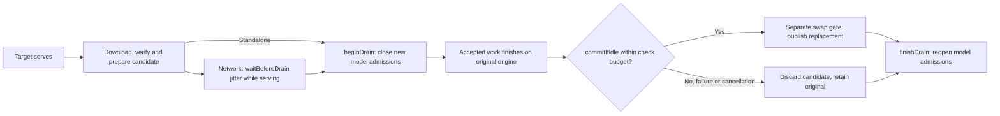

# Provider inference engine

> Last updated: 2026-09-10 · commit `5a3ffc27f`

How a chat-completion request is served inside the `darkbloom` provider
process in v0.9.1: one in-process engine (`mlx-swift-lm`
ContinuousBatchingV2, "CBv2"), one `EngineV2Bridge` per resident model, no
legacy engine and no subprocess. For the memory model see
[`hardware-support.md`](hardware-support.md); for KV/prefix caching see
[`prefix-cache.md`](prefix-cache.md).

## Context

Every advertised model is served through CBv2; a `model_type` without a CBv2
adapter is dropped from the advertised set at scan time and never loads
(`provider-swift/Sources/ProviderCore/Inference/EngineV2SupportedModels.swift`,
`isSupported`). The path is HTTP/WebSocket → `ProviderLoop` /
`StandaloneServer` → `MultiModelBatchSchedulerEngine` → `EngineV2Bridge` →
`EngineV2` → Metal.

| Component | Role | Code |
|---|---|---|
| `ProviderLoop` / `StandaloneServer` | Coordinator WebSocket and local HTTP ingress; model load/unload; heartbeat | `provider-swift/Sources/ProviderCore/ProviderLoop.swift`, `provider-swift/Sources/ProviderCore/Server/StandaloneServer.swift` |
| `MultiModelBatchSchedulerEngine` | Implements the upstream `MLXServerEngine` contract: OpenAI translation, chat-template render, tool-parser and tool-choice resolution, model acquire, dispatch by `request.model` | `provider-swift/Sources/ProviderCore/Inference/MultiModelBatchSchedulerEngine.swift` |
| `EngineV2Bridge` (one per model) | Provider↔CBv2 boundary: request-id normalisation, `CBv2Request` translation, resident/SSD selection, cache evidence, shared-KV reservation, deadline projection, `engine.submit`, event pump, telemetry | `provider-swift/Sources/ProviderCore/Inference/EngineV2Bridge.swift` with `+Submission`, `+Admission`, `+Lifecycle`, `+Resizing`, `+Identity`, `+Events`, `+Accounting`, `+Translation`, `+Profile`, `+Liveness`, `+MTP`, and `+PrefixCache` |
| `EngineV2SlotFactory` | Builds one slot: model prep, MTP assistant, KV-backend selection and vetoes, paged preflight, resident and SSD prefix-cache construction gates | `provider-swift/Sources/ProviderCore/Inference/EngineV2SlotFactory.swift` |
| `EngineV2Factory` (production) | `prepareProductionBackend`, `productionSchedulerConfig`, engine assembly | `provider-swift/Sources/ProviderCore/Inference/EngineV2Factory+Production.swift` with `+Configuration`, `+BackendPreparation`, and `+ModelAdapter` |
| `EngineV2Runtime` | Process-wide registry of bridges; capacity summary for heartbeats; cancellation fan-out | `provider-swift/Sources/ProviderCore/Inference/EngineV2Runtime.swift` |
| CBv2 engine loop | Admission, KV allocation, chunked prefill, batched decode, detokenisation, leases | `libs/mlx-swift-lm/Libraries/MLXLMCommon/ContinuousBatchingV2/EngineLoopV2.swift`, `SchedulerV2.swift` |
| promptsidecar boundary | Coordinator-side Rust process that computes the same `prompt_contract_id` and block chain ([`prefix-cache.md#block-hashing`](prefix-cache.md#block-hashing)) the provider derives with `PromptContractIdentity.compute(modelDirectory:)`; the provider never calls it | `coordinator/promptsidecar/`, `provider-swift/Sources/ProviderCoreFoundation/PromptContractIdentity.swift` — see [`prompt-contract-sidecar.md`](prompt-contract-sidecar.md) |

## Mechanism

### One request through the engine

```mermaid
sequenceDiagram
    participant C as Coordinator / local client
    participant S as MultiModelBatchSchedulerEngine
    participant B as EngineV2Bridge
    participant K as SSDPrefixCache + GlobalKVCacheBudget
    participant E as EngineV2 (CBv2)
    C->>S: OpenAI ChatCompletionRequest
    S->>S: render chat template, resolve tool parser / tool-choice, build CBv2TokenConstraint
    S->>B: submitTokenized(tokens, request)
    B->>B: normalise request id; FirstContentDeadline.check(); samplingParams
    B->>E: probe resident prefix [text-only]
    B->>K: stage useful SSD prefix if longer; reserve prompt+maxTokens [contiguous slots]
    B->>E: submit(CBv2Request, firstTokenDeadlineAdmission?)
    E->>E: admit → adopt reusable state → prefill chunks → decode steps
    E-->>B: publish complete recurrent / historical checkpoints [successful donor]
    E-->>B: token events … terminal CBv2Usage(CBv2RequestTiming)
    B-->>S: detokenised GenerationEvent stream
    S-->>C: SSE chunks / final response
```

Bridge-side order (`EngineV2Bridge.submitTokenized`): request-id
normalisation (`maxRequestIdLength = 256`; duplicates rejected) → first
deadline check → translation (`maxTokens = request.max_tokens ??
defaultMaxTokens`, 4096) → resident probe / useful SSD stage → shared-KV reservation (contiguous slots
only; segmented paged admission and backing use the shared native process owner) → final deadline
check → engine request-id mint → `engine.submit`. The terminal `CBv2Usage`
carries `CBv2RequestTiming`, copied verbatim onto the wire and folded into
`EngineProfile` (`EngineV2Bridge+Profile.swift`).

Resident publication uses a submission-unique `prefixCacheReceiptID`; the
sampling engine ID can repeat after a seeded request completes. The bridge
correlates checkpoint callbacks to that receipt so delayed donor callbacks
cannot advertise a successor's prompt. Ready anchors describe actual input
checkpoints, and billing retains the engine's actual matched/saved token counts
(`EngineV2Bridge+PrefixCache.swift`, `ResidentPrefixCacheEvidence.swift`).

### `CBv2RequestTiming`

Stamped by the engine thread only; instants are nanoseconds from the enqueue
instant (`0` = not observed, observed values clamped ≥ 1); durations are
elapsed nanoseconds. Numerics only — never tokens, text or hashes
(`libs/mlx-swift-lm/Libraries/MLXLMCommon/ContinuousBatchingV2/CBv2Contracts.swift`,
`CBv2RequestTiming`).

| Field | Meaning |
|---|---|
| `admittedNanos` | First step whose plan included the row (queue wait) |
| `kvAllocatedNanos` | Per-layer KV state allocated (`ensureKVState`) |
| `prefillFirstLaunchNanos` | First step that launched one of the row's prefill chunks |
| `promptComputedNanos` | Finalize of the step where `numComputedTokens >= promptTokens` |
| `firstTokenNanos` | Finalize of the step that confirmed the first generated token (excludes detokenisation) |
| `finishedNanos` | `finishRequest` instant |
| `readmissions`, `preemptions`, `capacityRequeues` | Waiting→running crossings after the first admission; preemptions; capacity requeues |
| `prefillChunks`, `packedPrefillChunks`, `visionChunks`, `soloStripeChunks` | Prefill chunk forwards: all; in a rectangular `[B, chunk]` cohort; carrying image spans; solo chunks wider than `prefillChunkSize` |
| `prefillChunkTokensMax` | Widest prefill chunk |
| `decodeSteps`, `chainedDecodeSteps` | Finalized steps confirming a token beyond the first (an MTP round with ≥ 1 confirmed token counts once); of those, chained-decode launches |
| `batchRowsSum`, `batchRowsMin`, `batchRowsMax` | Token-producing rows per participated step |
| `stepLatencyNanosSum`, `stepLatencyNanosMax` | Readback-done − `wallStartedNanos`, summed and max |
| `mtpRounds`, `mtpProposed`, `mtpAccepted` | MTP verify rounds, drafted tokens, accepted tokens |
| `pausedNanos`, `pauseCount` | Backpressure pause time and transitions |
| `detokDelayFirstNanos` | First token only: engine confirm → detokenised emit |
| `prefixLookupNanos`, `prefixAdoptionNanos` | Submit-thread prefix lookup (hash + lookup + plan); `applyAdoption` on the engine thread |

### Scheduler and loop configuration

| Setting | Value in production | Code |
|---|---|---|
| `maxConcurrentRequests` | `engine_v2_max_concurrent` (default and clamp: [`../provider/cli-reference.md#providertoml-keys-read-by-the-cli`](../provider/cli-reference.md#providertoml-keys-read-by-the-cli); per-model map `engine_v2_max_concurrent_by_model`) | `provider-swift/Sources/ProviderCore/Config/ProviderConfig.swift`, `productionSchedulerConfig` |
| `maxBatchedTokensPerStep` / `prefillChunkSize` / `maxWaiting` | 2048 / 512 / 64 (`CBv2SchedulerConfig` init defaults) | `CBv2Contracts.swift`, `CBv2SchedulerConfig` |
| `soloPrefillStripeTokens` | 2048 (`defaultSoloPrefillStripeTokens`); 4096 for dense Qwen3.5/3.8 (`Qwen35Model`, not `Qwen35MoEModel`); `DARKBLOOM_CBV2_SOLO_PREFILL_STRIPE` | `EngineV2Factory+Configuration.swift` |
| `maxConcurrentPartialPrefills` | 1; `DARKBLOOM_CBV2_MAX_PARTIAL_PREFILLS` | `EngineV2Factory+Configuration.swift`, `maxPartialPrefillsKey` |
| `enablePrefixCache` | true when the slot has an effective SSD cache, enabled paged resident cache, or recurrent checkpoint-bank configuration, or complete SSD checkpoint store; engine capability gates still apply | `EngineV2Factory+Production.swift` (`assembleProductionBuild`), `EngineV2.swift` |
| `requestTimeout` | 120 s legacy total wall, used only when `DARKBLOOM_CBV2_LEGACY_REQUEST_TIMEOUT` is affirmative | `EngineLoopV2.swift`, `CBv2EngineLoopConfig`; `EngineV2Factory+Configuration.swift` |
| `stepTimeout` | 30 s | `CBv2EngineLoopConfig` |
| `admissionLease`, `prefillProgressLease`, `decodeProgressLease`, `backpressureLease` | 120 s each | `CBv2EngineLoopConfig` |
| `safetyCeilingDecodeFloorTPS` | 5 | `CBv2EngineLoopConfig` |

Environment variables are named here, never defaulted; defaults live in
[`../reference/configuration.md`](../reference/configuration.md).

### Deadlines

The coordinator's relative first-content budget is anchored once at frame
receipt (`FirstContentDeadline(relativeBudgetMilliseconds:)`,
`provider-swift/Sources/ProviderCore/Coordinator/CoordinatorClientTypes.swift`)
and checked at every pre-content boundary. `prefill_deadline_mode` ∈ {`off`,
`enforce`}; when the config key is absent, `DARKBLOOM_PREFILL_DEADLINE_MODE`
exactly `off` disables, anything else enforces
(`provider-swift/Sources/ProviderCore/Inference/PrefillDeadlineMode.swift`).
Under `enforce` the bridge builds `CBv2FirstTokenDeadlineAdmission` only when
`maxConcurrentPartialPrefills == 1`, the request is not multimodal, and the
isolated cold-prefill EWMA is initialised; prefill and decode rates are haircut
by `deadlineProjectionRateHaircut = 0.5`. `WedgeMonitor.suspectStallSeconds =
10` flags a stalled slot
(`provider-swift/Sources/ProviderCore/Inference/WedgeMonitor.swift`).

### Multi-token prediction

| Target | Drafter | Activation |
|---|---|---|
| Qwen3.5 family (`qwen3_5`, `qwen3_5_moe`) | Embedded head (`Qwen35InlineMTPAssistant`, request-stateful) | `mtp_mode = "auto"` (default) when the checkpoint declares the embedded artifact |
| Nemotron 3.5 Lightning (`nemotron_h`) | Embedded head (`NemotronH35MTPAssistant`, request-stateful) | The MTP artifact must retain the embedded module and declare it; the non-MTP artifact remains target-only |
| Gemma 4 | Separate assistant checkpoint (`Gemma4AssistantDraftModel`, stateless) | Defaults to `auto` for exact `gemma-4-26b-qat-4bit`; other Gemma IDs require `on`. `SpecDecArtifactFunnel` resolves the catalog-declared `spec_dec` artifact, with `mtp_drafter_path` as a directory override |

The shared `MTPMode.enablesMTP` policy receives the exact model ID from both
`ProviderLoop.specDecPreparation` and `StandaloneServer.specDecPreparation`.
Startup catalog prewarm includes the automatic QAT target; ordinary slot loads
remain local-only and optional artifact prefetch remains asynchronous.
A provider or standalone server whose first QAT slot starts target-only monitors assistant
readiness asynchronously. It stages a verified assistant and an unregistered
replacement over the retained target, with a separate pending-memory lease and
only the minimum serviceable KV grant. Static fleet grants and network capacity
clamps reserve the candidate's assistant and KV bytes; if the original target
is concurrently unloaded, its retained weight basis stays counted until discard. Identity follows the shared
model container, so publishing a new bridge over that same target does not count
the weights twice. Preparation pins the target before its first asynchronous lookup;
model-load feasibility, LRU eviction and idle eviction exclude pinned targets.
Explicit retirement may still unload a slot, while retained weights remain charged.
Discard releases the actual target references before removing that charge and
regrowing survivor KV grants under the reslice/load gate. Network capacity quotes
refresh at staging changes and reject snapshots from older staging generations.
Reservations follow the load generation, so delayed cleanup cannot release a
new candidate's budget.

Once preparation succeeds, network providers keep serving during a random delay
from `UpdateJitter.delay`, using the existing
[`[provider] update_jitter_seconds`](../provider/cli-reference.md#providertoml-keys-read-by-the-cli)
setting. This staggers independent providers; it does not reserve fleet capacity
or guarantee that another provider remains available. Standalone serving skips
this fleet delay.

`MTPIdleUpgrade.run` then closes new admissions for this model through
`beginDrain`, while accepted network requests and local reservations finish on
the original engine. The admission fence is separate from the final publication
gate: accepted requests can still pass `ensureModelLoaded` and reach completion.
Network capacity advertises the existing `reloading` slot state and rejects
racing admissions with transient 503 `rejection_reason: slot_state` refusals. Other models remain
eligible; this does not put the whole provider into its update-draining state.
Standalone new acquisitions also receive 503 during the model drain.

The helper makes up to 120 idle checks with 500 ms pauses: about 60 seconds of
waiting plus actor-call latency, rather than a strict wall-clock deadline.
`commitIfIdle` requires no accepted work, queued engine requests or reserved KV
before taking the final swap gate. It publishes the replacement and releases the
old idle pool before regrowing grants; `finishDrain` reopens admission. On timeout,
cancellation or failure before publication, the helper discards the candidate
and reopens the original engine without force-cancelling accepted work. Target
replacement and insufficient staging memory also preserve the current owner;
no model is evicted for this optional upgrade. The readiness loop polls with
10–15 second jitter and retries unsuccessful staging after five minutes. Failed
artifact fetches independently back off exponentially with jitter, capped at
five minutes (`provider-swift/Sources/ProviderCore/Inference/MTPIdleUpgrade.swift`,
`MTPIdleUpgrade.run`; `provider-swift/Sources/ProviderCore/ProviderLoop+MTPDrain.swift`,
`waitBeforeMTPUpgradeDrain`, `beginMTPUpgradeDrain`;
`provider-swift/Sources/ProviderCore/ProviderLoop+MTPUpgrade.swift`, `commitMTPUpgradeIfIdle`;
`provider-swift/Sources/ProviderCore/Server/StandaloneServer+MTPUpgrade.swift`,
`commitMTPUpgradeIfIdle`).



Standalone uses the same coordinator catalog authority as the provider CLI
(`coordinator.url`), downloads in the background, and retains explicit local
assistant overrides. Transition logs report preparation duration, draining accepted work,
installation and fallback without repeating every readiness poll. Unpublished
candidates suppress periodic serving posture/cache logs; these start after the
old engine shuts down at commit, and closed bridges reject queued posture ticks. Missing, incompatible, or
memory-ineligible assistants preserve target-only serving; explicit `off` and
`DARKBLOOM_CBV2_MTP=0` disable MTP
(`provider-swift/Sources/ProviderCore/Config/ProviderConfig.swift`,
`provider-swift/Sources/ProviderCore/ProviderLoop+MTP.swift`,
`provider-swift/Sources/ProviderCore/Server/StandaloneServer+MTP.swift`).

`MTPAutomaticVerificationPolicy`: `initialDraftTokens = 1`;
`fixedDraftTokens = nil` for request-stateful drafters (controller bounded by
the assistant: Qwen 0…4, Nemotron 0…7)
and exact stateless `gemma-4-26b-qat-4bit` (controller bounded to 0…1).
Other stateless assistants and explicit offline Gemma verification controls
retain fixed depth `1`; `maxRectangularTokens = 8` on
M3/M4/M5 and `4` on M1/M2/unknown, lowered only by
`DARKBLOOM_MTP_MAX_RECTANGULAR_TOKENS`
(`provider-swift/Sources/ProviderCore/Inference/MTPAutomaticVerificationPolicy.swift`).
Gemma uses bounded rectangular target verification: one target traversal scores
its seed and draft columns, while ordered attention and speculative transactions
preserve causal visibility and discard rejected suffixes. The depth controller
compares ordinary decode's chained commit intervals with actual committed output
across bounded eight-round MTP learning windows. Each round streams immediately
and retains the ordinary cancellation, output-budget and capacity gates. Adaptive
stateless Gemma pairs seed time with seed output,
excludes the first positive-shape compilation from its steady estimate while
retaining that work in telemetry. Warmup is keyed by exact verification row count
and draft depth, so three and four rows do not share a cold-shape exemption.
Learning resets when request membership changes or a participating request finishes,
even if its numeric ID is reused. Launch-generation checks discard late cost,
baseline and acceptance observations from older work. It selects ordinary decode when that is faster and periodically probes
again (`CBv2MTPCommittedGoodputClock`, `CBv2MTPCommittedWindow`,
`CBv2MTPDepthController` in
`libs/mlx-swift-lm/Libraries/MLXLMCommon/ContinuousBatchingV2/MTP/`). Wider evaluation
can change floating-point rounding and generated wording; acceptance remains
target-authoritative. Supported sampling uses the target distribution and an
output-indexed RNG stream. Penalties, bias, logprobs, stop strings and token
constraints retain their ordinary-decode exclusions. Explicit offline serial
verification remains available as a diagnostic oracle; drafter-required modes
retain priority (`provider-swift/Sources/ProviderCore/Inference/EngineV2MTPAssistant.swift`,
`providerMTPVerificationPolicy`).
Nemotron's assistant uses one speculative request and adaptive depth up to
seven proposed tokens. Captured target verification, batched M=1 projections
and KV-only trusted-history priming default on, with separate rollback controls.
Its verifier builds a layer-major window while retaining native one-token
recurrence and every-prefix state. These controls do not establish
a fleet-readiness claim. Target activations retain the
checkpoint's native dtype and persistent Mamba SSM state remains FP32
(`libs/mlx-swift-lm/Libraries/MLXLLM/Models/NemotronH35MTP.swift`,
`NemotronH35MTPAssistant`; controls in the
[configuration reference](../reference/configuration.md)).
Engine contract: `CBv2MTPConfig` with `testedMaxDraftTokens` (≤ 7) and
`testedMaxSpeculativeBatch = 8`
(`libs/mlx-swift-lm/Libraries/MLXLMCommon/ContinuousBatchingV2/MTP/MTPContractsV2.swift`).
The common planner caps every offered draft depth at the shortest eligible
row's remaining output slots minus one, including fixed and exploration offers.
A valid input carry does not consume the mandatory next target-output slot.
With one output slot left, draft depth is zero; existing seed/history handling
continues without speculative verification. The cap runs before step/KV
reservation (`libs/mlx-swift-lm/Libraries/MLXLMCommon/ContinuousBatchingV2/MTP/EngineLoopV2+MTPPlanning.swift`,
`mtpDepthWithinOutputBudget`, `beginMTPPlan`).
The process-wide kill switch is `DARKBLOOM_CBV2_MTP` (`CBv2MTPConfig.envEnabled`;
see [`../reference/configuration.md`](../reference/configuration.md)).

Complete SSD recurrent reuse with a persistent MTP assistant requires the
serializable `CBv2MTPPrefixCheckpointCoding` contract. The Qwen implementation
restores normalized trusted prompt history into fresh assistant state; verifier
mode and draft policy remain unchanged. The default store streams only a
matched checkpoint and retains no idle payload RAM. The optional resident bank
uses `CBv2MTPPrefixCheckpointDrafter` and retains its existing compact-publication
and conservative reservation behavior. Resident model measurements do not yet
validate the streamed SSD path; exact gates and validation scope are in
[`prefix-cache.md`](prefix-cache.md).
The Nemotron embedded assistant implements the same explicit checkpoint
contract using exact shifted post-norm target history and frontier
(`libs/mlx-swift-lm/Libraries/MLXLLM/Models/NemotronH35MTP+PrefixCheckpoint.swift`,
`capturePrefixCheckpoint`, `restorePrefixCheckpoint`). At a committed prefill
boundary, the complete checkpoint pairs target attention KV and Mamba state
with immutable trusted assistant history. Restoring it creates fresh
request-owned assistant pages and primes them before drafting; speculative
draft KV is never shared. This is prompt-prefix reuse, not persistence of an
in-flight speculative round. The ordinary attention-only prefix index remains
disabled for this hybrid model.

### Sampling parameters

`EngineV2Translation.samplingParams(from:)`
(`provider-swift/Sources/ProviderCore/Inference/EngineV2Bridge+Translation.swift`):

| OpenAI field | Honoured as | Default |
|---|---|---|
| `temperature` | `temperature` | `0.0` (greedy) |
| `top_p` | `topP` | `1.0` |
| `top_k` | `topK` | `0` |
| `repetition_penalty` | `repetitionPenalty` | `1.0` |
| `frequency_penalty` / `presence_penalty` | `frequencyPenalty` / `presencePenalty` | `0` |
| `seed` | `seed`; also keys a stable engine request id | nil |
| `logit_bias` | `logitBias` — string keys parsed to non-negative `Int`; invalid keys dropped and counted | `[:]` |
| `logprobs` + `top_logprobs` | `topLogprobs = logprobs ? min(20, max(1, top_logprobs ?? 0)) : 0` | `0` |
| `max_tokens` | `maxTokens = max_tokens ?? 4096` | 4096 |
| `stop` | `stopStrings`, matched on held-back detokenised text (`EngineV2Bridge+StopSequence.swift`) | `[]` |
| `min_p`, `priority` | **Ignored**: always `0` | — |
| `n`, `best_of` | **Not represented**: one alternative | — |

### Streaming reasoning state

`NativeChannelSplitter` treats tool payloads as opaque while routing reasoning
markers. It emits unclosed-frame payload incrementally and retains only a
possible closing-marker suffix; it does not buffer an entire unfinished tool
call (`provider-swift/Sources/ProviderCore/Inference/NativeChannelSplitter.swift`).

`ReasoningPromptProbe.streamingPrefix` in
`provider-swift/Sources/ProviderCore/Inference/ReasoningPromptProbe.swift`
decodes only the final eight prompt tokens to initialize Qwen/DeepSeek
streaming parsing. A prompt ending in `<think>` receives an opening marker;
a prompt ending in `</think>` receives an empty closed block. The downstream
think parser consumes these prefixes as state transitions, so reasoning or
ordinary answer text streams immediately. The prefix bypasses tool parsing
and does not add output frames or token usage.

Both text and media paths in `MultiModelBatchSchedulerEngine` apply the
probe before forwarding model output. This matters for media because
`templateAdditionalContext` defaults `enable_thinking` to false unless the
caller supplied a thinking control: the template already closes the block,
and generated answers need not emit another marker. Explicit `.none`, other
parser families, non-streaming requests, and unrecognized prompt tails receive
no prefix. Unknown tails preserve legacy close-only reasoning parsing.

### Tool-call parsers

`ServerToolParser.resolve(requested:modelType:)` honours an explicit
`tool_call_parser`, else `ToolCallFormat.infer(from:configData:)`
(`libs/mlx-swift-lm/Libraries/MLXLMServer/Parsing/ServerToolParser.swift`,
`libs/mlx-swift-lm/Libraries/MLXLMCommon/Tool/ToolCallFormat.swift`).
Resolution happens before submit so a bad parser name never orphans a request.

| `model_type` rule | Format | Parser |
|---|---|---|
| `gpt_oss` | `.harmony` | `HarmonyToolCallParser` |
| prefix `gemma` (`gemma4`, `gemma4_text`) | `.gemma` | `GemmaFunctionParser` |
| prefix `qwen3_5` | `.qwen35` | `Qwen35ToolCallParser` (XML first, framed-JSON fallback) |
| prefix `qwen3_next` | `.xmlFunction` | `XMLFunctionParser` |
| prefix `nemotron` | `.nemotron` | Native Nemotron tool-frame parser |
| `llama` with `vocab_size ≥ 128000` or `rope_scaling.rope_type == "llama3"` | `.llama3` | `Llama3ToolCallParser` |
| prefix `lfm2` / `glm4` / `mistral3` | `.lfm2` / `.glm4` / `.mistral` | `PythonicToolCallParser` / `GLM4ToolCallParser` / `MistralToolCallParser` |
| anything else, including `qwen3_vl_moe` | `nil` → `.json` | `JSONToolCallParser` (`<tool_call>…</tool_call>`) |

`.kimiK2` and `.minimaxM2` exist but are selectable only explicitly.

### Chat-template render check

At scan time `TemplateRenderCheck.renderOK(at:)` compiles every template
source in runtime precedence (`chat_template.jinja`, `chat_template.json`,
`tokenizer_config.json`) with swift-jinja `lstripBlocks: true, trimBlocks:
true` and renders canonical fixtures; multimodal fixtures run only when
`config.json` declares `vision_config`. The result is advertised per model as
`template_render_ok` (`nil` = no template, key omitted); the model stays
advertised, but the provider's capacity quotes reject it with reason `template`
and the coordinator can refuse to route
(`provider-swift/Sources/ProviderCoreFoundation/TemplateRenderCheck.swift`,
`provider-swift/Sources/ProviderCore/Coordinator/CapacityQuoteEngine.swift`).

### Vision constraints

- **One image per tower pass.** `EngineV2VisionTowerRun` drives the Qwen
  tower one image per call and evaluates final + DeepStack features before the
  next; peak attention memory falls from `(Σᵢ nᵢ)²` to `maxᵢ nᵢ²`. Gemma 4's
  SigLIP tower is one image per forward pass already. Each image is checked
  with `MLX.withError` right after `eval`
  (`provider-swift/Sources/ProviderCore/Inference/EngineV2VisionTowerRun.swift`).
- **N² budget.** `N_max = floor(sqrt(maxBufferLength / (headFactor ×
  attentionElementBytes)))` with `attentionElementBytes = 2`,
  `fusedAttentionHeadDims = {64, 80, 128}` (`headFactor = 1` when fused-eligible,
  else `numHeads`); `DARKBLOOM_VISION_MAX_TOWER_PATCHES` is a lower-only ceiling
  (`provider-swift/Sources/ProviderCore/Inference/VisionTowerBudget.swift`).
- **Media caps** (`provider-swift/Sources/ProviderCore/Inference/MediaIngest.swift`):
  `maxImagePixels` 100 Mpx, `maxRequestImagePixels` 384 Mpx,
  `maxMediaDecodedBytes` 25 MiB, `maxVideoDurationSeconds` 600,
  `maxImagesPerRequest` 16, `maxVideosPerRequest` 8,
  `maxRequestVideoFramePixels` 384 Mpx; `decodeOverheadFactor = 4`.
- Vision requests never stage SSD blocks and get no deadline projection; VLM
  slots require a backend that honors span masks. The current paged cache
  satisfies that structural gate; supported vision serving still requires its
  own regression checks before paged default promotion ([`prefix-cache.md`](prefix-cache.md)).
  `DARKBLOOM_ENGINE_V2_VLM_PARITY_CHECK` gates the load-time parity prefill
  between MLXVLM's inline text model and the extracted MLXLLM target
  (`provider-swift/Sources/ProviderCore/Inference/EngineV2VLMTextExtraction.swift`).

### Paged runtime type failures

Paged writes validate actual projected K/V dtypes against the pool's observed
native contract. `CBv2PagedKVWriteValidation` latches the first mismatch across
that pool and prevents later cache reads or writes from extending the failed
graph. `EngineLoopV2.checkedModelForward` checks the latch before evaluating
or sampling the result. Failure synchronizes submitted work, restores valid
write fences, and retires affected rows and recurrent/MTP aliases before their
request reservations return; cursor rollback alone cannot repair an overwritten
window. The diagnostic contains only layer and dtype metadata
(`libs/mlx-swift-lm/Libraries/MLXLMCommon/ContinuousBatchingV2/Paged/PagedKVWriteValidation.swift`,
`libs/mlx-swift-lm/Libraries/MLXLMCommon/ContinuousBatchingV2/EngineLoopV2.swift`).
The [runtime validation report](../reports/2026-09-05-paged-runtime-dtype.md)
records tiny-model correctness and remaining release gates.

### Supported `model_type`s and quantization

| `model_type` | Family | Notes |
|---|---|---|
| `gpt_oss` | GPT-OSS | Harmony tool format; loaded paged historical complete checkpoints; measured activation floor ([`hardware-support.md`](hardware-support.md)) |
| `gemma4` | Gemma 4 VLM wrapper | Served through its text tower + vision prefill; historical complete SSD is text-only and requires the loaded paged capability |
| `gemma4_text` | Gemma 4 text target | Assistant checkpoints share the prefix; never advertised |
| `qwen3_5` | Dense Qwen 3.5/3.8, recurrent state | Embedded MTP head; complete streamed SSD checkpoints on native contiguous or segmented paged KV; explicit paging requires observed native types; resident bank is opt-in |
| `qwen3_5_moe` | Qwen 3.5/3.6 MoE, recurrent state | Same complete-checkpoint and segmented-native paging gates as dense Qwen |
| `qwen3_vl_moe` | Qwen3-VL MoE wrapper | Served via CBv2 adapter + vision prefill; `cbv2Capabilities` all `false` (no prefix reuse, paged, compiled decode, packed prefill or MTP) |
| `nemotron_h` | Nemotron 3.5 Lightning | Advertisement is limited to `EngineV2SupportedModels.isNemotron35ListingModelID`, not every checkpoint sharing this type. Native Mamba/MoE/attention target; `nemotron35LightningModelID` is target-only and `nemotron35LightningMTPModelID` retains the embedded head. Listing eligibility is not registry publication or performance qualification |

Quantization is detected by name, in order: `4bit`|`q4`|`int4` → `4bit`;
`8bit`|`q8`|`int8` → `8bit`; `3bit`|`q3` → `3bit`; `bf16`; `fp16`|`f16`; else
`quantize_config.json` `bits`; else `nil`
(`provider-swift/Sources/ProviderCore/Models/ModelScanner+Discovery.swift`,
`detectQuantization`). KV quantization was retired in v0.8.0. Memory sizing
(the `1.2` padded estimate and the load gate) is in
[`hardware-support.md`](hardware-support.md).

### Coordinator-serving native channels

Coordinator requests construct `MultiModelBatchSchedulerEngine` inside
`provider-swift/Sources/ProviderCore/ProviderLoop+InferenceHandler.swift`
(`handleInferenceRequest`). Native Nemotron output passes through
`NativeToolStreamRouter` and the SDK's typed `.parsed` event, so tool arguments
are not reparsed as reasoning markers. `MLXOpenAIService.streamChatCompletionFrames`
serializes SSE frames; the provider encrypts and sends them back over the
coordinator connection. This integration does not start a local HTTP endpoint
or change consumer/OpenRouter routing.

## Invariants

1. Only `model_type`s accepted by `EngineV2SupportedModels.isSupported` are
   advertised or loaded; an unsupported load request fails the advertised-set
   guard (404) — `EngineV2SupportedModels.swift`.
2. A request is admitted to a contiguous slot only after
   `prompt + maxTokens` bytes are reserved in `GlobalKVCacheBudget`; a second
   reservation failure rejects with `token_budget_exhausted` —
   `EngineV2Bridge+Submission.swift` (`submitTokenized`).
3. Every request carries a first-content deadline anchored at frame receipt and
   checked before submit; the budget value is the coordinator's, not a provider
   constant — `CoordinatorClientTypes.swift` (`FirstContentDeadline`).
4. No request outlives its leases: 120 s admission / prefill-progress /
   decode-progress / backpressure leases and a 30 s step timeout —
   `EngineLoopV2.swift` (`CBv2EngineLoopConfig`).
5. Tool parser and tool-choice strategy are resolved before submit —
   `MultiModelBatchSchedulerEngine.swift` (`ServerToolParser.resolve`).
6. `CBv2RequestTiming` contains numerics only — `CBv2Contracts.swift`.
7. MTP is fail-open to target-only decode: artifact resolution failure or
   `DARKBLOOM_CBV2_MTP` off never refuses a load — `EngineV2SlotFactory+MTP.swift`,
   `MTPContractsV2.swift` (`envEnabled`).

## Failure modes

| Symptom | Cause | Where |
|---|---|---|
| `token_budget_exhausted: duplicate request ID` | Request id already live on the bridge | `EngineV2Bridge+Submission.swift` |
| `token_budget_exhausted: … shared KV budget has no headroom` | Two failed `GlobalKVCacheBudget` reservations | `EngineV2Bridge+Submission.swift` |
| `PreContentDeadlineFailure.deadlineUnreachable` | First-content budget spent before submit or during prefill projection | `CoordinatorClientTypes.swift`, `EngineV2Bridge+Submission.swift`, `EngineV2Bridge+Admission.swift` |
| Request cancelled by lease | No admission/prefill/decode progress within 120 s, or a step over 30 s | `EngineLoopV2.swift` |
| Model dropped from advertised set | Unsupported `model_type` | `EngineV2SupportedModels.swift` |
| Model advertised, capacity quotes rejected with reason `template` | Scan-time render check failed (`template_render_ok = false`) | `TemplateRenderCheck.swift`, `provider-swift/Sources/ProviderCore/Coordinator/CapacityQuoteEngine.swift` (`reject(.template)`) |
| Image rejected | Over `MediaIngest` caps or over the N² tower budget | `MediaIngest.swift`, `VisionTowerBudget.swift` |
| Load refused: `pagedUnavailable` (503) | Explicit `engine_v2_kv_backend = paged` and the paged pool/kernels failed | `EngineV2Factory+BackendPreparation.swift` — see [`prefix-cache.md`](prefix-cache.md) |
| Slot flagged wedged | No engine progress for `suspectStallSeconds = 10` | `WedgeMonitor.swift` |

## Code map

| Concern | File / symbol |
|---|---|
| Bridge submit path | `provider-swift/Sources/ProviderCore/Inference/EngineV2Bridge+Submission.swift` (`submitTokenized`) |
| Request identity | `provider-swift/Sources/ProviderCore/Inference/EngineV2Bridge+Identity.swift` (`normalizedRequestId`, `mintEngineRequestId`) |
| Admission and resizing | `provider-swift/Sources/ProviderCore/Inference/EngineV2Bridge+Admission.swift` (`firstTokenDeadlineAdmission`); `provider-swift/Sources/ProviderCore/Inference/EngineV2Bridge+Resizing.swift` (`updateKVBytesCapacity`) |
| Cancellation and completion | `provider-swift/Sources/ProviderCore/Inference/EngineV2Bridge+Lifecycle.swift` (`cancel`, `shutdown`); `provider-swift/Sources/ProviderCore/Inference/EngineV2Bridge+Events.swift` (`runPump`, `finishAndEmit`) |
| Sampling translation | `provider-swift/Sources/ProviderCore/Inference/EngineV2Bridge+Translation.swift` (`samplingParams`) |
| Slot construction | `provider-swift/Sources/ProviderCore/Inference/EngineV2SlotFactory.swift` |
| Scheduler config, backend prep | `provider-swift/Sources/ProviderCore/Inference/EngineV2Factory+Configuration.swift` (`productionSchedulerConfig`); `provider-swift/Sources/ProviderCore/Inference/EngineV2Factory+BackendPreparation.swift` (`prepareProductionBackend`) |
| Model adaptation and assembly | `provider-swift/Sources/ProviderCore/Inference/EngineV2Factory+ModelAdapter.swift` (`ProductionModelAdapter`, `directServingModel`); `provider-swift/Sources/ProviderCore/Inference/EngineV2Factory+Production.swift` (`assembleProductionBuild`) |
| Refusal taxonomy, retired env knobs | `provider-swift/Sources/ProviderCore/Inference/EngineV2Config.swift` (`EngineV2RefusalReason`) |
| Deadlines | `provider-swift/Sources/ProviderCore/Coordinator/CoordinatorClientTypes.swift`, `provider-swift/Sources/ProviderCore/Inference/PrefillDeadlineMode.swift`, `provider-swift/Sources/ProviderCore/Inference/WedgeMonitor.swift` |
| MTP | `provider-swift/Sources/ProviderCore/Inference/MTPAutomaticVerificationPolicy.swift`, `provider-swift/Sources/ProviderCore/Inference/EngineV2MTPAssistant.swift`, `libs/mlx-swift-lm/Libraries/MLXLMCommon/ContinuousBatchingV2/MTP/MTPContractsV2.swift` |
| Vision | `provider-swift/Sources/ProviderCore/Inference/MediaIngest.swift`, `provider-swift/Sources/ProviderCore/Inference/VisionTowerBudget.swift`, `provider-swift/Sources/ProviderCore/Inference/EngineV2VisionTowerRun.swift`, `provider-swift/Sources/ProviderCore/Inference/EngineV2VisionPrefill.swift` |
| Tool constraints, reasoning probe | `provider-swift/Sources/ProviderCore/Inference/ToolConstraintFactory.swift`, `provider-swift/Sources/ProviderCore/Inference/ReasoningPromptProbe.swift` |
| Engine contracts, timing, scheduler, loop | `libs/mlx-swift-lm/Libraries/MLXLMCommon/ContinuousBatchingV2/CBv2Contracts.swift`, `SchedulerV2.swift`, `EngineLoopV2.swift`, `CBv2RequestTiming+Stamps.swift` |

## Related

- [`prefix-cache.md`](prefix-cache.md) — KV layouts, resident prefix reuse, SSD tier
- [`hardware-support.md`](hardware-support.md) — memory model and load gate
- [`components/provider.md`](components/provider.md), [`components/mlx-swift.md`](components/mlx-swift.md) — process components and pinned submodules
- [`prompt-contract-sidecar.md`](prompt-contract-sidecar.md) — coordinator-side contract identity
- [`../reference/configuration.md`](../reference/configuration.md) — every `DARKBLOOM_*` variable and config key with its default
- [`../reference/protocol-messages.md`](../reference/protocol-messages.md) — wire shape of capacity, timing and status fields
