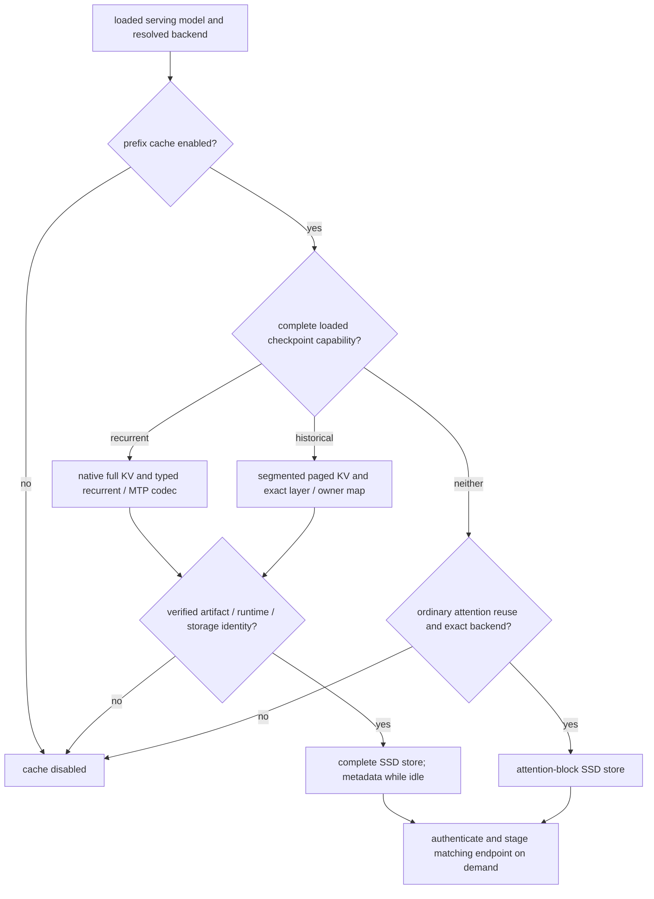

# KV cache layouts and prefix caching

> Last updated: 2026-09-10 · commit `5a3ffc27f`

How the provider lays out a request's KV cache, how it decides whether a
previously computed prefix can be reused, and where reusable state lives:
encrypted SSD checkpoints by default, with resident paged blocks and recurrent
checkpoint banks available through an explicit memory opt-in.
Read this to understand why a box
serves a repeated prompt cold or warm; for the file format and every SSD knob
see [`../reference/ssd-kv-cache.md`](../reference/ssd-kv-cache.md), and for the
coordinator's use of cache state in routing see
[`cache-aware-routing.md`](cache-aware-routing.md).

## Context

CBv2 owns one KV cache per running request. Two backends exist; the choice is
made per slot at load time and fixed for the slot's life. Prefix reuse — seeding
a new request's KV from blocks computed by an earlier request with the same
token prefix — is only safe when the cached rows can be restored exactly, which
depends on the model's layer layout (full attention vs sliding window vs
recurrent state) and on the backend. Paged reuse shares physical pages within
the existing pool when opted in. Dense and MoE Qwen restore complete recurrent
checkpoints streamed from SSD. Loaded historical-attention capabilities also
allow exact paged window checkpoints for GPT-OSS and Gemma. Optional resident
banks use the slot KV grant.
SSD snapshots survive beyond a request without retaining their KV in resident memory
(`provider-swift/Sources/ProviderCore/Inference/PrefixCachePolicy.swift`,
`provider-swift/Sources/ProviderCore/Inference/PrefixCachePolicy+Hybrid.swift`).

## Mechanism

### KV layouts

| | Contiguous | Paged |
|---|---|---|
| Type | `CBv2ContiguousKVBackend`, `EngineV2KVBackendKind.contiguous` | `PagedKVBackend`, `EngineV2KVBackendKind.paged`; `PagedKVPool.pageSize = 16` tokens |
| Selected by | Explicit `"contiguous"`, `"auto"` outside the exact candidate allowlist, or fallback | Explicit `"paged"` (global or `engine_v2_kv_backend_by_model`), or candidate `"auto"` for the exact IDs below, subject to policy gates |
| Memory | Per-request grant reserved at admission in `GlobalKVCacheBudget` | Production starts with empty segmented storage under the admitted slot grant; native admission reserves growth before allocation and retains live owners across grant changes. Actual committed backing is reported separately. |
| On failure | — | Under `auto`: degrade to contiguous with a `fallback:<why>` reason; under explicit `paged`: refuse the load with `EngineV2ProductionError.pagedUnavailable` (503) |
| Prefix-reuse backend | `.contiguousUnquantized` | `.pagedFP16` |

The default setting remains `"auto"`. In the candidate, it prefers paged only
for these exact fleet model IDs, not family names, aliases or substrings:

- `qwen3.5-35b-a3b`
- `qwen3.6-35b-a3b-vl-mtp-mxfp8`
- `EigenLabs/Qwen3.8-27B-4bit-mtp`
- `gpt-oss-20b`
- `gemma-4-26b-qat-4bit`
- `nvidia-nemotron-3.5-lightning`
- `EigenLabs/NVIDIA-Nemotron-3.5-Lightning-30B-A3B-MLX-4bit-mtp`
- `mlx-community/NVIDIA-Nemotron-3.5-Lightning-30B-A3B-4bit` (target-only artifact)

Every other ID, including unlisted Qwen artifacts, Gemma 8-bit and unknown
models, resolves contiguous under `auto`. Per-model configuration still overrides
the global setting, and explicit `"contiguous"` keeps a cohort model contiguous
(`provider-swift/Sources/ProviderCore/Inference/EngineV2KVBackendPolicy.swift`,
`parseSelection`, `preferredBackend`; called by `prepareProductionBackend` in
`provider-swift/Sources/ProviderCore/Inference/EngineV2Factory+BackendPreparation.swift`).

Slot policy can force contiguous when a VLM cache lacks span-mask support
(`EngineV2KVBackendPolicy.applySlotVetoes`). The factory then applies model
capability (`supportsPagedKV == false`, reason `model_capability`), the
negative-only `DARKBLOOM_CBV2_PAGED_KV` kill switch, and the version-scoped
crash-loop guard in that order. The crash-loop guard applies only to `auto`,
returning eligible cohort models to contiguous while its version matches.
Clearing it restores automatic selection on the next model load, not guaranteed
paged service. Capability/span-mask vetoes and the kill switch can also override
an explicit `paged` selection; the crash-loop guard cannot. Automatic paged
construction failures fall back to contiguous with a reason; the same failures
refuse an explicit `paged` load. Paged construction runs
`PagedKernelPreflight` in a child process (`defaultChildTimeout = 120 s`,
`DARKBLOOM_NO_UPDATE_CHECK=1` injected), then constructs an empty segmented
backend with the already admitted slot grant. There is no separate eager-pool
budget. Segment, buffer and kernel address limits remain native checks
(`provider-swift/Sources/ProviderCore/Inference/EngineV2Factory+SegmentedBackend.swift`,
`makeSegmentedPagedBackend`; `PagedKernelPreflight.swift`). Grant derivation,
shrink/regrow and live-memory gates are explained in
[KV slot grants](hardware-support.md#kv-slot-grants).
Paged construction also probes the loaded target's actual K/V after two prefill
tokens and one decode token. Its per-layer native types govern storage and
admission; a nonempty `DARKBLOOM_CBV2_PAGED_KV_DTYPE` (`float16` or `float32`)
must match every observed layer. The probe rejects asymmetric or changing K/V
types. Dense and MoE Qwen targets require both this table and segmented storage
(`requiresNativePagedKV`); they no longer have an unconditional paged veto.
Complete Qwen checkpoints support native contiguous and segmented paged storage.
Historical attention checkpoints require the resolved paged backend and an exact
loaded layer/owner/type map; ordinary attention snapshots remain a separate codec.

**Release acceptance remains incomplete.** The [final versioned build](../reports/2026-09-07-release090-final-build.md),
[Qwen 3.5/3.6 concurrency checks](../reports/2026-09-07-qwen-concurrency-final.md)
and [memory lifecycle checks](../reports/2026-09-06-coresidency-lifecycle.md)
record completed validation. Final sustained, connected-serving, quality and
production-key restart checks remain subject to the
[acceptance criteria](../design/release-090-acceptance.md).
This selection change is not a release or deployment claim. SSD prefix reuse
defaults on for the exact Qwen and Nemotron Lightning IDs above and
`gemma-4-26b-qat-4bit`.
Gemma QAT uses the paged historical-attention complete checkpoint; automatic
MTP resolves its catalog assistant through `SpecDecArtifactFunnel`, and a
contiguous fallback does not reuse that checkpoint. An explicit affirmative
`DARKBLOOM_PREFIX_CACHE` opts other models into their existing cache eligibility
checks; a non-affirmative nonempty value disables all tiers. Both SSD codecs,
local/connected load hashing and benchmark expectations use the model-scoped
`PrefixCachePolicy.isEnabled(modelId:environment:)` gate in
`provider-swift/Sources/ProviderCore/Inference/PrefixCachePolicy+Activation.swift`.
Resident retention remains off unless explicitly enabled through the separate
memory flag (`PrefixCachePolicy.isMemoryEnabled`).

The production paged factory binds its empty segmented pool to the shared
process memory owner before constructing the engine. Its native admission owns
full request promises and actual paged backing; the bridge does not duplicate
those promises as contiguous-style request reservations. Contiguous slots retain
their existing provider reservation path. See
[process ownership](hardware-support.md#process-ownership).

The [provider integration report](../reports/2026-09-05-paged-complete-provider.md)
records factory and ownership tests, with exact-model and release gates still open.

### Block hashing

SSD snapshots and coordinator routing proofs are hashed in whole blocks of
`CBv2BlockHasher.defaultBlockSize = 256`
tokens (`libs/mlx-swift-lm/Libraries/MLXLMCommon/ContinuousBatchingV2/BlockHasher.swift`),
mirrored by `PrefixCachePolicy.blockSize`. The coordinator's promptsidecar computes the same chain
(`darkbloom-block-chain-v1`, `PromptContractIdentity.blockHashVersion`) so it
can predict which provider holds a prefix — see
[`prompt-contract-sidecar.md`](prompt-contract-sidecar.md).

Paged resident lookup hashes physical pages (`PagedKVPool.pageSize = 16`);
those hashes are not coordinator routing proofs. Recurrent lookup indexes
exact token sequences and can restore only checkpoints captured at complete,
uniform prefill chunks. A radix branch or a 256-token hash boundary alone
does not establish reusable recurrent state. The resident evidence adapter
converts actual reusable input checkpoints into the coordinator's 256-token
chain; it excludes the final input token so a hit still leaves work to produce
the next logits (`ResidentPrefixCacheEvidence.swift`,
`CBv2RecurrentCheckpointGeometry` in `HybridPrefixCacheContract.swift`).

### Prefix-reuse capability

`CBv2PrefixReuseCapability.derive(layerKinds:backend:modelSupportsPrefixReuse:)`
(`libs/mlx-swift-lm/Libraries/MLXLMCommon/ContinuousBatchingV2/PrefixReusePlan.swift`)
decides the ordinary attention-snapshot and resident-page reuse plan once per
slot. Complete recurrent and historical attention checkpoints use separate
loaded capabilities and direct restore; the replay table below does not govern
those complete checkpoints:

1. `modelSupportsPrefixReuse == false` → unsupported
   (`.modelRequestStateUnsupported`). `CBv2ModelCapabilities.supportsPrefixReuse`
   is `false` for the Qwen3.5 family (`.initialRecurrentTarget`, recurrent
   state) and for Qwen3-VL (`MLXVLM.Qwen3VL.cbv2Capabilities`); GPT-OSS and
   Gemma 4 are `.attentionOnly` (all capabilities on) —
   `libs/mlx-swift-lm/Libraries/MLXLMCommon/ContinuousBatchingV2/RecurrentStateV2.swift`,
   `EngineV2Factory+BackendPreparation.swift` (`prepareProductionBackend`).
2. Empty layout → `.emptyLayout`; a layer with non-positive
   `headDim`/`kvHeads`/`queryHeads`, an invalid `sharesKVWithLayer`, or a
   window ≤ 0 → `.invalidLayout`.
3. `maxWindow = max(window)`, `windowCount = #slidingWindow layers`,
   `replayBound = windowCount × maxWindow`; `hasOwningFullAfterWindow` when a
   storage-owning `.full` layer follows a windowed layer (interleaved hybrid).
4. Backend `.unknown` → unsupported.

| Layout | `.contiguousUnquantized` | `.pagedFP16` |
|---|---|---|
| All full-attention layers (`replayBound == 0`) | `.direct` | `.direct` |
| Sliding-window layers, no owning full layer after a windowed one | `.tailReplay` | `.tailReplay` |
| Interleaved hybrid (Gemma 4, GPT-OSS) | `.frozenFullReplay`, `conservativeReplayBoundTokens = replayBound` | `.frozenFullReplay`, same bound |
| `supportsPrefixReuse == false` (Qwen3.5 family, Qwen3-VL) | unsupported | unsupported |

On a hit with `matched` tokens the engine recomputes
`cbv2RequiredRecompute = min(windowCount × maxWindow, matched)` tokens (0 when
there are no sliding-window layers;
`libs/mlx-swift-lm/Libraries/MLXLMCommon/ContinuousBatchingV2/CBv2Contracts.swift`).
With `M` the matched boundary and `R` that recompute span, sliding rows are
rebuilt from `C = M − R`; under `.frozenFullReplay` the storage-owning full
rows keep their exact cached K/V immutable through `M` while replay runs, so
replay error cannot persist into full-attention state
(`libs/mlx-swift-lm/Libraries/MLXLMCommon/ContinuousBatchingV2/SequenceKV/FrozenReplayFullSequenceKV.swift`).

### Resident tiers

Both tiers require `DARKBLOOM_PREFIX_CACHE_MEMORY=1` and the global cache
switch to remain enabled (`PrefixCachePolicy.isMemoryEnabled`). They retain
no reusable payloads by default. The measurements in this section describe the
previous resident implementation, not SSD performance.

| Tier | Lookup and ownership | Gate |
|---|---|---|
| Paged resident blocks | Tenant-scoped chained page hashes; generation-validated page handles; shared rows retain physical pages until release | Paged backend and `supportsPrefixReuse`; configured by `PrefixCachePolicy.residentConfig` |
| Recurrent checkpoint bank | Exact token radix index per `cacheSalt`; immutable recurrent checkpoints plus full-attention KV; each adopter receives independent mutable state | Eligible dense or MoE Qwen `supportsRecurrentCheckpointReuse`, native-precision contiguous KV, owning full-attention rows, and a valid slot cache budget |

The recurrent bank captures only uniform, complete prompt chunks; dense Qwen's
solo prefill stripe is normally 4096 tokens. Packed or ragged prefill and
preemption disarm capture. Completed `stop`/`length` donors publish after the
checkpoint and KV have materialized, before their terminal completion. The bank
inherits the earliest checkpoint and the endpoint actually adopted, then rolls
its newest checkpoint as the continuation advances. It never inherits a donor
endpoint beyond the adopted prefix. A completion with no new checkpoint refreshes
the donor's existing entry when that entry still owns the inherited roots;
otherwise it republishes them with the new request's backing. An arbitrary
shared token prefix is never treated as a recurrent checkpoint
(`libs/mlx-swift-lm/Libraries/MLXLMCommon/ContinuousBatchingV2/Prefix/EngineLoopV2+HybridPrefix.swift`,
`HybridPrefixCache.swift`).

Publication first reserves the donor's full-attention KV backing. If it does
not fit, the bank waits for checkpoint roots to materialize, then reserves and
copies KV only through the latest retained checkpoint that fits alongside its
checkpoint state. It drops later checkpoints if necessary; it never invents a
recurrent boundary or slices recurrent state. The destination is charged before
the copy, and the engine keeps the donor's source backing reserved until
publication completes. If no checkpoint fits, publication creates no entry
(`HybridPrefixCache.swift`, `publish` / `prepareCompactionLocked`;
`libs/mlx-swift-lm/Libraries/MLXLMCommon/ContinuousBatchingV2/Prefix/HybridPrefixPublication.swift`,
`compactedBytes` / `compactKV`).

The bank is bound to the loaded model instance, model ID, prompt contract and
build identity; authenticated `cacheSalt` separates tenants. Its reservation
comes from the existing slot KV grant and includes retained, staged and
publishing state. LRU eviction releases unpinned entries; adopted or pending
state remains charged across capacity shrink. After a downward slot re-slice,
backend/admission capacity can retain the conservative carve returned while
pins or publications were outstanding, even after their physical arrays retire.
It is restored only by a later external budget update, with no time bound; this
can reduce concurrency near the grant. An adopter's separate source-KV backing
reservation also stays conservative through request completion. This opt-in bank itself writes no recurrent
state to disk (`HybridPrefixCache.swift` / `resizeReservation`,
`HybridCheckpointOwnership.swift`, `EngineV2.swift` / `updateKVBytesCapacity`,
`Prefix/EngineV2+HybridPrefix.swift` / `hybridPrefixLookup`). Configurable limits are in
[`../reference/configuration.md#resident-recurrent-prefix-cache`](../reference/configuration.md#resident-recurrent-prefix-cache).

A persistent MTP assistant must implement `CBv2MTPPrefixCheckpointDrafter`.
`Qwen35InlineMTPAssistant` captures the complete normalized trusted prompt
transition backlog and final hidden frontier before draft-head KV exists;
restore creates fresh mutable assistant caches. This preserves prompt history
without sharing an active speculative round or changing verification policy
(`libs/mlx-swift-lm/Libraries/MLXLMCommon/ContinuousBatchingV2/MTP/MTPPrefixCheckpoint.swift`,
`libs/mlx-swift-lm/Libraries/MLXLLM/Models/Qwen35MTP+PrefixCheckpoint.swift`).
The preceding provider milestone passed 82 XCTest cases plus 2,468 Swift
Testing tests in 252 suites
([provider test log](../reports/evidence/2026-09-05-radix-prefix-cache/candidate-mtp-final-provider-tests.txt.gz)).
The normal-MTP model oracle passed all seven rows with identical generated token
IDs; five warm rows reused 4,096 tokens
([MTP oracle verdict](../reports/evidence/2026-09-05-radix-prefix-cache/candidate-mtp-verdict.json)).
This is focused compatibility evidence for the measured model and inputs, not a
broad MTP performance result or validation of the separately combined refactor.

The compact-publication build passed the three-row direct-engine normal-MTP
oracle for a 12,091-token donor and repeat, plus a 12,099-token continuation.
One 512 MiB KV copy retained the 4,096- and 8,192-token checkpoints in
970,637,304 bytes, with no capacity refusals. The repeat and continuation reused
8,192 tokens without another compaction. Repeat TTFT was 15.115 seconds on the
clean baseline and 5.086 seconds with reuse; the donor's final-token-to-DONE tail
was about 7.7 ms. All three generated-token comparisons passed
([long-prompt verdict](../reports/evidence/2026-09-05-radix-prefix-cache/candidate-compact-mtp-long-verdict.json),
[artifact and raw-evidence manifest](../reports/evidence/2026-09-05-radix-prefix-cache/candidate-compact-evidence-manifest.json)).
These are single ordered observations from immutable compact build 4, before
the auxiliary-admission follow-up; they do not validate the combined refactor
or live coordinator routing. This build uses a bank budget of up to 1 GiB inside the slot grant.
Compaction does not remove the conservative resize and adopted-source
reservations described above.

Only the recurrent bank currently publishes resident-ready routing evidence.
It requires verified weight and prompt-contract identities to advertise
`prefix_cache_memory_models`; local reuse can operate without the attested
weight hash because entries never cross loaded model instances. Paged resident
hits report the memory tier locally but do not yet publish coordinator holder
anchors. Resident and durable SSD routing evidence remain separate; see
[`cache-aware-routing.md`](cache-aware-routing.md).

### SSD provider gates

Standalone loading retains the pre/post weight-load hash bracket for dense
Qwen complete-checkpoint eligibility. Only a known configuration lacking both
attention and complete-checkpoint reuse skips the SSD-only bracket. Unknown
configurations retain it; connected attestation retains its existing bracket.
The verified aggregate passes through slot construction without a new model
hash (`PrefixCachePolicy+LoadHash.swift`, `StandaloneServer.swift`).

`prepareCompletePrefixCache` reads the effective loaded serving model, including
its resolved text tower for a VLM. Qwen requires owning full-attention rows,
native KV types and a typed persistent MTP checkpoint codec when configured.
Historical attention requires a loaded capability marker, native segmented
storage and the exact ordered layer/owner/window/type map. Gemma's stateless
per-round assistant remains configured normally; unsupported persistent
assistant state disables this path.

The engine repeats these checks against its actual backend. Missing verified
model, template, binary or loaded-metallib identity fails cold. Storage identity
includes resolved backend/layout, every layer's dtype, page and segment geometry,
maximum buffer size, and historical owner/window/attention fields. It enters
both the compatibility fingerprint and disk namespace. Model weights are not
rehashed per request (`EngineV2SlotFactory+CompletePrefixCache.swift`,
`CompleteCheckpointStorageIdentity.swift`, `PrefixCachePolicy+CheckpointIdentity.swift`).

Native-precision KV does not require unquantized model weights. Dense Qwen's
complete checkpoint capability derives activation dtype from a floating
embedding weight, or from an affine `QuantizedEmbedding` whose scales and
biases have the same supported floating dtype (`float16`, `bfloat16` or
`float32`). Packed integer embedding weights are storage, not the KV or
recurrent convolution-state dtype. The shared resolver supplies both the
complete KV capability and recurrent state specification; unsupported or
inconsistent embedding typing disables complete checkpoint reuse
(`libs/mlx-swift-lm/Libraries/MLXLLM/Models/Qwen35+CompleteCheckpoint.swift`,
`cbv2CheckpointActivationDType`, `cbv2CompleteCheckpointKVDTypes`;
`libs/mlx-swift-lm/Libraries/MLXLLM/Models/Qwen35.swift`, `cbv2RecurrentStateSpec`).

The attention-only `PrefixCachePolicy.adoptionIsExact` restriction remains:
resolved contiguous Gemma/GPT-OSS slots do not build an attention snapshot
cache because that path diverged from cold output in the earlier model gate.
Complete recurrent restoration is a separate codec, not an exception granting
attention-only reuse to Qwen (`EngineV2SlotFactory.swift`). Every SSD store
also requires a valid artifact prompt contract. The directory-based contract
requires a passing
render check; its versioned request-clock renderer supports the accepted
`strftime_now` format using a date owned by the request. Declaring a supported
model family does not bypass that gate
(`provider-swift/Sources/ProviderCoreFoundation/PromptContractIdentity.swift`,
`compute(modelDirectory:)`).

### Streamed complete checkpoints

A natural `stop`/`length` donor exports its actual complete prompt checkpoints,
one per file. Qwen includes attention KV, recurrent state and normalized typed
MTP history. Historical attention includes exact owning full rows and the
window contents at the captured boundary, preserving borrower relationships.
Capture retains the first and latest reusable endpoints. Window copies finish
before successor writes and remain owned until their captured stream drains.
The encrypted manifest binds exact input token IDs, scope, checkpoint position,
codec/layout and tensor descriptors. DBK3 writes bounded tensor segments into
one atomically published file; failed/cancelled exports grant no ready evidence.
After commit, the engine retires donor/export aliases before publishing the
actual ready anchor and DONE. The default path keeps only metadata between
requests and carves no permanent bank reservation from the slot
(`libs/mlx-swift-lm/Libraries/MLXLMCommon/ContinuousBatchingV2/Prefix/CompleteCheckpointCapture.swift`,
`CBv2CompleteCheckpointCapture.publish`; `SSDHybridCheckpointStore+Write.swift`).

On a request, the bridge probes input-chain metadata for an existing endpoint.
Complete checkpoints are probed deepest-first. `SSDBlockIndex.freshFileBytes`
reads each candidate's size and recency under one lock, so request lookup visits
only its prefix candidates and does not scan unrelated cached entries. A probe
does not extend TTL; authenticated use still controls recency updates and
validates replacements or evictions (`SSDHybridCheckpointStore+Read.swift`).
Before file I/O, the provider reserves bounded host read scratch. A shared
native process owner prices destinations, zero-fill scratch, metadata and full
request promises through Admission; it does not duplicate the provider's host
I/O charge. The contiguous compatibility path retains its existing provider and
native reservations. After manifest authentication, the engine validates the
import plan and reserves each native buffer's allocator bound before allocation.
A second bounded read authenticates the whole file while filling the native
destination. Only this matched checkpoint is staged. The
single-use imported handle carries ownership until its array aliases retire;
paged adoption replaces the temporary stage with the full request promise,
settles measured backing and retains auxiliary state separately. Cancellation,
rejection and shutdown release staged state. Missing,
corrupt, changed-epoch or incompatible state falls back cold. Complete hits
save their actual checkpoint position with zero replay; an absent shorter
recurrent checkpoint is never inferred from a longer one
(`SSDHybridCheckpointStore+Read.swift`, `SSDCheckpointStageReservation.swift`,
`libs/mlx-swift-lm/Libraries/MLXLMCommon/ContinuousBatchingV2/Prefix/EngineV2+CompleteCheckpoint.swift`,
`libs/mlx-swift-lm/Libraries/MLXLMCommon/ContinuousBatchingV2/Prefix/CompleteCheckpointTransfer.swift`). Format and exact bounds are in
[`../reference/ssd-kv-cache.md`](../reference/ssd-kv-cache.md).

Attention-only SSD staging streams its separate block codec into evaluated
native tensors, preserving raw dtype bits and head/token order. It retains no
whole-run decrypted buffer. If corruption shortens a useful prefix, it reserves
a compact-copy peak and releases each larger tensor before lowering the byte
charge; cancellation or refusal drops the private arrays before refunding the
reservation (`SSDNativePrefixBuilder.swift`, `SSDPrefixCache.swift`, `stage`).
With the memory opt-in, the bridge compares useful resident and SSD candidates;
capacity and exactness gates still decide whether adoption can proceed
(`EngineV2Bridge+SSDPrefixCache.swift`, `SSDPrefixCache+StagePlan.swift`).

Coordinator receipt negotiation and local Go tests are recorded in
[`cache-aware-routing.md`](cache-aware-routing.md). The initial complete SSD
implementation passed [121 native tests](../reports/evidence/ssd-prefix-2026-09-05/native-initial/manifest.json)
and [266 focused provider tests](../reports/evidence/ssd-prefix-2026-09-05/provider-initial/manifest.json).
The combined follow-up source snapshot, including bounded attention reads,
the engine read-scratch API and benchmark SPI/key controls, passed
[82 XCTest cases and 2,505 Swift Testing tests across 257 suites](../reports/evidence/ssd-prefix-2026-09-05/provider-followup/results.json)
with zero failures. Its exact source hashes are retained with that evidence.
The [five-test native checkpoint-engine suite](../reports/evidence/ssd-prefix-2026-09-05/native-read-lease/results.json)
also passed with zero failures or skips on its separately recorded source snapshot.
The later affine-embedding dtype correction passed
[36 native tests across configuration, checkpoint codec/engine and MTP trim suites](../reports/evidence/ssd-prefix-2026-09-05/native-quantized/results.json),
with zero failures or skips. These snapshots have separate source manifests.
The combined refactor passed
[82 XCTest cases and 2,506 Swift Testing tests across 257 suites](../reports/evidence/ssd-prefix-2026-09-05/integrated-final/results.json)
with zero failures, on integrated source `97a439359` with native library
`72902c4a9`. Model evidence and its measured artifact scope are recorded in the
[SSD model report](../reports/2026-09-05-ssd-prefix-cache-model-check.md). The Qwen probes use an
explicit ephemeral-key control; successful production-key process-restart reuse
and live multi-provider routing remain unmeasured. Earlier resident measurements
are separate from the SSD results.

## Invariants

1. **Default caching retains no idle payload RAM.** Both resident tiers require
   `DARKBLOOM_PREFIX_CACHE_MEMORY=1`; the global disable wins. Dense and MoE Qwen may
   construct a complete SSD store on resolved contiguous or paged, while attention-only
   SSD remains restricted to exact resolved paged backends —
   `PrefixCachePolicy.swift`, `EngineV2SlotFactory+CompletePrefixCache.swift`.
2. Complete SSD identity binds verified model/template and loaded build/numerics;
   missing identity disables reuse — `PrefixCachePolicy+CheckpointIdentity.swift`.
3. Attention-only snapshots cannot restore recurrent state. Only an accepted
   typed complete codec can do so — `EngineV2.swift`,
   `libs/mlx-swift-lm/Libraries/MLXLMCommon/ContinuousBatchingV2/Prefix/CompleteCheckpointCodec.swift`.
4. Snapshot replay after a hit is exactly `min(windowCount × maxWindow, matched)`
   and owning full rows stay frozen through `M` — `CBv2Contracts.swift`
   (`cbv2RequiredRecompute`), `FrozenReplayFullSequenceKV.swift`.
5. Vision requests do not reuse resident checkpoints or stage SSD blocks — `EngineV2Bridge+Submission.swift`
   (`submitTokenized`, text-only guard).
6. `DARKBLOOM_CBV2_PAGED_KV` can only force contiguous; there is no
   environment variable that turns paged on — `EngineV2KVBackendPolicy.swift`
   (`killSwitchEnvKey`).
7. Every `stage()` reservation is released on cancellation, preemption,
   refusal, shutdown or unload; a preempted request restarts cold —
   `EngineV2Bridge+SSDPrefixCache.swift`.
8. A recurrent hit restores only a stored checkpoint with compatible chunk
   geometry; a matching longer token branch cannot supply an absent shorter
   checkpoint — `HybridPrefixCache.swift` (`lookup`),
   `HybridPrefixCacheContract.swift` (`CBv2RecurrentCheckpointGeometry`).

## Failure modes

| Symptom | Cause | Where |
|---|---|---|
| `disabled` / `unsupported_backend` on an attention-only slot | Resolved contiguous; complete recurrent restore has a separate gate | `EngineV2SlotFactory.swift` |
| `disabled` / `unsupported_layout` | Neither an exact attention layout nor an eligible complete recurrent codec | `EngineV2SlotFactory.swift` |
| `disabled` / `weight_hash_unavailable` or `runtime_identity_unavailable` | No verified weight hash or no `PromptContractIdentity` for the model directory | `SSDPrefixCacheFactory.swift` |
| `pending` / `scan_pending`, `error` / `scan_failed` | Startup disk scan not finished or failed | `SSDPrefixCache.swift` |
| SSD repeat served cold | Prefix shorter than one block; staging reservation refused; donation below the effective-token floor; TTL expiry; box-wide LRU eviction | `SSDPrefixCache.swift` (`donate`), `SSDBlockIndex.swift` |
| Recurrent repeat served cold | No actual checkpoint, incompatible geometry/identity, scope mismatch, SSD stage refusal/eviction, or opt-in memory bank eviction | `HybridPrefixCache.swift`, `EngineLoopV2+HybridPrefix.swift`, `PrefixCachePolicy+Hybrid.swift` |
| Local memory hit gives no coordinator routing preference | Paged resident publication is not implemented; recurrent slot missing verified identity; or holder evidence expired/invalidated | `ResidentPrefixCacheEvidence.swift`, `coordinator/registry/cache_routing_hints.go` |
| Load refused with `pagedUnavailable` | Explicit `paged` and preflight/capacity/pool construction failed | `EngineV2Factory+BackendPreparation.swift` |
| Every slot contiguous despite `paged` config | `DARKBLOOM_CBV2_PAGED_KV` set to a negative value, or `supportsPagedKV == false` | `EngineV2KVBackendPolicy.swift`, `EngineV2Factory+BackendPreparation.swift` |

## Code map

| Concern | File / symbol |
|---|---|
| Backend selection, kill switch, vetoes | `provider-swift/Sources/ProviderCore/Inference/EngineV2KVBackendPolicy.swift` (`parseSelection`, `preferredBackend`, `applySlotVetoes`, `degradesPagedFailure`) |
| `auto` resolution, paged fallback | `provider-swift/Sources/ProviderCore/Inference/EngineV2Factory+BackendPreparation.swift` (`prepareProductionBackend`) |
| Prefix-cache gate, exactness, capability | `provider-swift/Sources/ProviderCore/Inference/PrefixCachePolicy.swift` (`isEnabled`, `adoptionIsExact`, `prefixReuseCapability`, `ssdDiskBudgetBytes`) |
| Construction-skip logic | `provider-swift/Sources/ProviderCore/Inference/EngineV2SlotFactory.swift` (`PrefixCacheConstructionStatus`) |
| Reuse plan | `libs/mlx-swift-lm/Libraries/MLXLMCommon/ContinuousBatchingV2/PrefixReusePlan.swift` (`CBv2PrefixReuseCapability.derive`) |
| Frozen full replay | `libs/mlx-swift-lm/Libraries/MLXLMCommon/ContinuousBatchingV2/SequenceKV/FrozenReplayFullSequenceKV.swift`, `libs/mlx-swift-lm/Libraries/MLXLMCommon/ContinuousBatchingV2/SequenceKV/ContiguousKVBackend.swift` |
| Paged pool | `libs/mlx-swift-lm/Libraries/MLXLMCommon/ContinuousBatchingV2/Paged/PagedKVPool.swift`, `libs/mlx-swift-lm/Libraries/MLXLMCommon/ContinuousBatchingV2/Paged/PagedLayerCache.swift` |
| Paged resident index and adoption | `libs/mlx-swift-lm/Libraries/MLXLMCommon/ContinuousBatchingV2/Paged/PrefixBlocks/PagedPrefixBlockIndex.swift`, `libs/mlx-swift-lm/Libraries/MLXLMCommon/ContinuousBatchingV2/Paged/PrefixBlocks/PagedKVBackend+PrefixSharing.swift` |
| Recurrent radix bank and ownership | `libs/mlx-swift-lm/Libraries/MLXLMCommon/ContinuousBatchingV2/Prefix/HybridPrefixCache.swift`, `libs/mlx-swift-lm/Libraries/MLXLMCommon/ContinuousBatchingV2/Prefix/HybridCheckpointOwnership.swift`, `libs/mlx-swift-lm/Libraries/MLXLMCommon/ContinuousBatchingV2/Prefix/TokenRadixIndex.swift` |
| Bounded recurrent KV publication | `libs/mlx-swift-lm/Libraries/MLXLMCommon/ContinuousBatchingV2/Prefix/HybridPrefixPublication.swift` — `CBv2HybridPrefixPublication`, `compactedBytes`, `compactKV`; `HybridPrefixCache.swift` — `prepareCompactionLocked` |
| Recurrent checkpoint capture and adoption | `libs/mlx-swift-lm/Libraries/MLXLMCommon/ContinuousBatchingV2/Prefix/EngineLoopV2+HybridPrefix.swift`, `libs/mlx-swift-lm/Libraries/MLXLMCommon/ContinuousBatchingV2/Prefix/EngineV2+HybridPrefix.swift` |
| Resident budget policy and routing receipts | `provider-swift/Sources/ProviderCore/Inference/PrefixCachePolicy+Hybrid.swift` (`hybridConfig`), `provider-swift/Sources/ProviderCore/Inference/ResidentPrefixCacheEvidence.swift`, `provider-swift/Sources/ProviderCore/Inference/PrefixCacheEvidenceSequencer.swift` |
| Complete SSD construction and identity | `provider-swift/Sources/ProviderCore/Inference/EngineV2SlotFactory+CompletePrefixCache.swift`, `provider-swift/Sources/ProviderCore/Inference/PrefixCachePolicy+CheckpointIdentity.swift` |
| Complete SSD stream/import/ownership | `provider-swift/Sources/ProviderCore/KVCacheSSD/SSDHybridCheckpointStore+Read.swift`, `provider-swift/Sources/ProviderCore/KVCacheSSD/SSDHybridCheckpointStore+Write.swift`, `libs/mlx-swift-lm/Libraries/MLXLMCommon/ContinuousBatchingV2/Prefix/CompleteCheckpointTransfer.swift` |
| SSD tier | `provider-swift/Sources/ProviderCore/KVCacheSSD/` (`SSDPrefixCache`, `SSDPrefixCacheFactory`, `SSDPrefixCachePolicy`, `SSDBlockStore`) |
| Status and outcome vocabularies | `provider-swift/Sources/ProviderCore/Protocol/Messages.swift` (`PrefixCacheStatusReason`, `PrefixCacheDonationOutcome`) |

## Related

- [`../reference/ssd-kv-cache.md`](../reference/ssd-kv-cache.md) — DBK3 format, paths, env knobs, eviction, per-family table
- [`cache-aware-routing.md`](cache-aware-routing.md) — how the coordinator consumes cache state
- [`inference.md`](inference.md) — the request path this cache sits in
- [`hardware-support.md`](hardware-support.md) — the KV budget the grants come from
- [`../design/ssd-kv-cache.md`](../design/ssd-kv-cache.md), [`../design/kv-cache-lookup-shadowing.md`](../design/kv-cache-lookup-shadowing.md) — superseded design records
