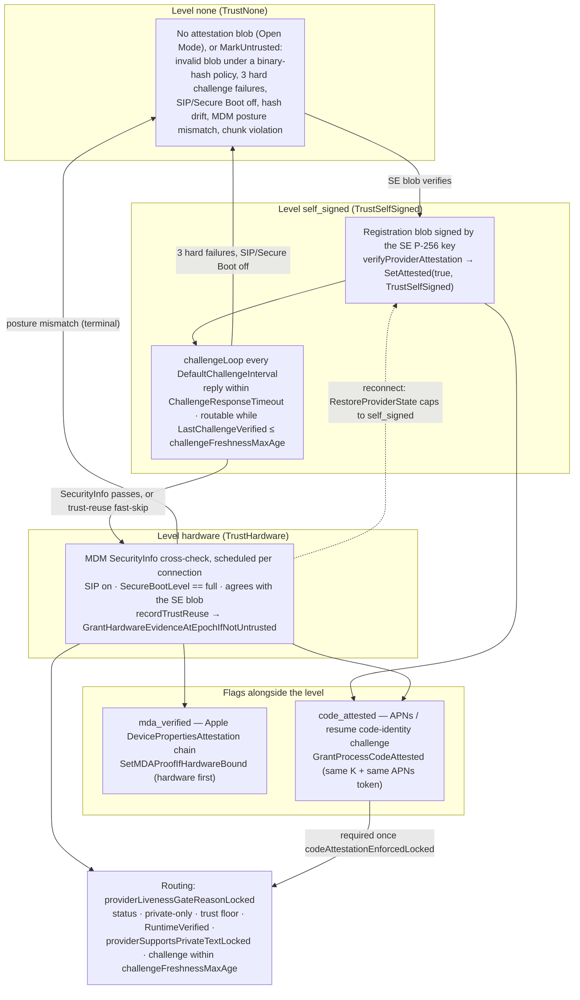

# Provider attestation

> Last updated: 2026-09-13 · commit `1f52a71fb`

How the coordinator decides how far to trust a provider connection: three
trust levels (`none`, `self_signed`, `hardware`), two flags carried alongside
the level (`mda_verified`, `code_attested`), the five-minute challenge that
keeps the verdict fresh, and the single routing gate that consumes all of it.

## Context

Providers are adversarial until proven otherwise ([`../../threat-model.yaml`](../../threat-model.yaml),
`ADV-001`). A provider's self-report is worthless on its own — the reporter is
the thing being judged — so every claim that matters is either signed by a key
the provider cannot extract (the Secure Enclave P-256 key), corroborated by
Apple's MDM subsystem (SecurityInfo), or proven by a channel only genuine code
can use (APNs). The result feeds one routing decision: the public floor is
`Registry.MinTrustLevel` (`EIGENINFERENCE_MIN_TRUST`, default under
[configuration](../../reference/configuration.md#routing-admission-and-ttft); `coordinator/registry/config.go`).

## Mechanism

### Trust levels

`TrustLevel` is a closed enum (`coordinator/registry/provider.go`); `trustRank`
orders it `hardware` = 2, `self_signed` = 1, `none` = 0, anything else = −1.

| Level | Granted when | Lost when | Code |
|---|---|---|---|
| `none` | Default for a new `Provider`; a registration without an attestation blob stays connected at `none` when no binary-hash policy is configured (Open Mode) | — | `coordinator/api/provider.go` (`verifyProviderAttestation`) |
| `none` + status `untrusted` | Missing, unparseable, or invalid blob **while a binary-hash policy is configured**; any `MarkUntrusted` | Hard untrust is terminal for the connection; `MarkUntrustedTransient` (missed challenges) recovers on the next passing challenge | `coordinator/registry/attestation_policy.go` (`MarkUntrusted`, `MarkUntrustedTransient`, `RecordChallengeSuccess`) |
| `self_signed` | The SE-signed registration blob verifies and passes the checks in [Layer 1](#layer-1--secure-enclave-registration-blob); `SetAttested(true, TrustSelfSigned)` and `LastChallengeVerified = now` make the provider immediately eligible below the public floor | Challenge failure accounting, or any hard untrust | `coordinator/api/provider.go` (`verifyProviderAttestation`); `coordinator/registry/provider_evidence.go` (`SetAttested`) |
| `hardware` | An MDM `SecurityInfo` response for this connection reports SIP enabled and `SecureBootLevel == "full"`, and both agree with the SE blob — the **only** grant path; or the trust-reuse fast-skip re-applies recent device evidence after a fresh signed challenge | Never restored from the store on reconnect (capped to `self_signed`); posture mismatch → `MarkUntrusted` | `coordinator/api/provider.go` (`verifyProviderViaMDM`); `coordinator/api/trust_reuse.go` (`recordTrustReuse`, `tryTrustReuseFastSkip`); `coordinator/registry/persistence.go` (`RestoreProviderState`) |

Two booleans travel with the level and never change it:

| Flag | Meaning | Set by | Cleared by |
|---|---|---|---|
| `MDAVerified` (`mda_verified`) | An Apple `DevicePropertiesAttestation` chain verified to the pinned Apple Enterprise Attestation Root CA and bound to this connection's SE key or serial | `coordinator/registry/provider_evidence.go` (`SetMDAProofIfHardwareBound`) — requires `TrustLevel == hardware` first | `RestoreProviderState` on every reconnect; re-earned or re-bound live |
| `CodeAttested` / `FreshCodeAttested` (`code_attested`) | The live process proved it holds the registered X25519 key `K` and the SE key by answering a code-identity challenge | `coordinator/registry/provider_evidence.go` (`GrantProcessCodeAttested`) | APNs token rotation, hard untrust, `SetCodeAttested(false)` |

### Layer 1 — Secure Enclave registration blob

The provider signs an `AttestationBlob` with a P-256 key held in the Secure
Enclave and sends it in `register.attestation`
(`provider-swift/Sources/ProviderCore/Security/AttestationBuilder.swift`). The
key is persistent and keychain-backed with an ephemeral fallback — see
[`identity-binding.md`](./identity-binding.md).

Signed fields (`coordinator/attestation/attestation.go`, `AttestationBlob`;
alphabetical, matching Swift `.sortedKeys`): `authenticatedRootEnabled`,
`binaryHash`?, `chipFamily`?, `chipName`, `encryptionPublicKey`?,
`hardwareModel`, `hypervisorActive`? (legacy, decoded only so pre-v0.6.31
signatures still verify), `metallibHash`?, `osVersion`, `publicKey` (65-byte
uncompressed P-256, base64), `rdmaDisabled`, `runtimeCapabilities`?,
`secureBootEnabled`, `secureEnclaveAvailable`, `serialNumber`?, `sipEnabled`,
`systemVolumeHash`?, `timestamp` (RFC 3339). The envelope is
`{attestation, signature}` (`SignedAttestation`); the signature is DER ECDSA
over SHA-256 of the exact `attestation` bytes as sent (`AttestationRaw`), with
`marshalSortedJSON` as the fallback when raw bytes are absent.

| Check (in order) | Outcome on failure | Code |
|---|---|---|
| Blob present | Open Mode: stay `none`, connected. Policy configured: `MarkUntrusted` | `coordinator/api/provider.go` (`verifyProviderAttestation`) |
| Signature verifies; `secureEnclaveAvailable`, `sipEnabled`, `secureBootEnabled` all true (`rdmaDisabled`, `authenticatedRootEnabled` recorded only) | `Valid = false`; `MarkUntrusted` only under a binary-hash policy | `coordinator/attestation/attestation.go` (`Verify`, `VerifyJSON`, `ParseP256PublicKey`) |
| Freshness, providers ≥ `minProviderVersionForReconnectAttestation` ([version gating](../../reference/api-contracts.md#version-gating)): `timestamp` within ±`RegistrationAttestationMaxAge` = 2m of coordinator time | `MarkUntrusted` ("attestation replay rejected"). Older providers keep their blob but `ChipFamily`, `RuntimeCapabilities`, `MetallibHash` are stripped | `coordinator/api/provider.go` (`verifyProviderAttestation`); `coordinator/attestation/attestation.go` (`CheckTimestamp`) |
| Key binding: `register.public_key` == blob `encryptionPublicKey` | Invalid; `MarkUntrusted` only under a policy | `coordinator/api/provider.go` (`verifyProviderAttestation`) |
| Binary hash, only when `binaryHashEnforce && policyConfigured`: `binaryHash` present and in the known-good set | `MarkUntrusted`. Otherwise the hash is drift telemetry (v0.6.0: code identity replaced it as the control) | `coordinator/api/provider.go` (`verifyProviderAttestation`, `binaryHashPolicySnapshot`) |
| Success | `SetAttested(true, TrustSelfSigned)`; `trust_status{self_signed, online, "SE attestation verified, awaiting MDM verification"}`; `LastChallengeVerified = now` | `coordinator/api/provider.go` (`verifyProviderAttestation`, `sendTrustStatus`) |

The provider's `secureBootEnabled` self-report is a historical proxy:
`checkSecureBootEnabled` delegates to `checkAuthenticatedRootEnabled`
(`csrutil authenticated-root status`, `diskutil` fallback) and is "not presented
as a local Secure Boot verdict" (`provider-swift/Sources/ProviderCore/Security/SecurityHardening.swift`).
The coordinator's Secure Boot signal is MDM `SecurityInfo.SecureBootLevel`
(Layer 3).

### Layer 2 — periodic challenge

| Fact | Value | Code |
|---|---|---|
| Cadence | `DefaultChallengeInterval` = 5m (`ServerConfig.ChallengeInterval`); the loop starts after `register` succeeds | `coordinator/api/provider.go` (`challengeLoop`) |
| Challenge | `attestation_challenge{nonce, timestamp}`; nonce = 32 random bytes, base64; timestamp UTC RFC 3339; one pending challenge per provider | `coordinator/api/provider.go` (`sendChallenge`, `generateNonce`) |
| Reply timeout | `ChallengeResponseTimeout` = 30s → transient failure | `coordinator/api/provider.go` (`handleTransientChallengeFailure`) |
| Reply | `attestation_response{nonce, signature, status_signature?, public_key, sip_enabled?, secure_boot_enabled?, rdma_disabled?, binary_hash?, active_model_hash?, python_hash?, runtime_hash?, template_hashes?, model_hashes?, hypervisor_active?}` | `coordinator/protocol/messages.go` (`AttestationResponseMessage`) |
| Signature | ECDSA P-256 over SHA-256(`nonce + timestamp`, plain concatenation) with the SE key from the registration blob — never a key in the reply | `coordinator/api/provider.go` (`verifyChallengeResponse`); `coordinator/attestation/attestation.go` (`VerifyChallengeSignature`) |
| Status signature | ECDSA over the canonical status JSON; when present and valid, `statusFieldsTrusted = true`. Canonical = sorted-key compact JSON without HTML escaping; absent fields are omitted, never `false`. Keys: `active_model_hash`?, `binary_hash`?, `grpc_binary_hash`?, `hypervisor_active`? (legacy — emitted only when the provider sent it, so pre-v0.6.31 signatures still verify; never used for a decision), `model_hashes`?, `nonce`, `python_hash`?, `rdma_disabled`?, `runtime_hash`?, `secure_boot_enabled`?, `sip_enabled`?, `template_hashes`?, `timestamp` | `coordinator/attestation/attestation.go` (`StatusCanonicalInput`, `BuildStatusCanonical`, `VerifyStatusSignature`) |
| Checks after the signatures | `sip_enabled` must be present (fail closed) and true — false → `MarkUntrusted`; `secure_boot_enabled == false` → `MarkUntrusted`; `rdma_disabled` must be present (value informational); binary-hash / metallib / model-hash drift against registration → `MarkUntrusted`; `ReconcileAttestedRuntimeCapabilities` mismatch → `MarkUntrusted` + `StatusPolicyViolation` close; provider version ≥ `MinProviderVersion`; reported hashes checked against the [runtime manifest](#runtime-manifest) (excludes from routing, never untrusts) | `coordinator/api/provider.go` (`verifyChallengeResponse`) |
| Success | `ChallengeVerifiedSIP = sip_enabled`; `UpdateModelWeightHashes`; `RecordChallengeSuccess` (clears a transient untrust and drains queued requests); then `tryTrustReuseFastSkip` may re-grant `hardware` from durable device evidence | `coordinator/api/provider.go` (`verifyChallengeResponse`); `coordinator/api/trust_reuse.go` (`tryTrustReuseFastSkip`) |
| Failure accounting | `RecordChallengeFailure(providerID, transient)`; `transient` = reason `timeout` / `no response`. A hard failure clears `LastChallengeVerified` and `ChallengeVerifiedSIP` at once (unroutable immediately); at `MaxFailedChallenges` = 3 consecutive failures the provider is `MarkUntrusted` (hard) or `MarkUntrustedTransient` (transient); at `MaxConsecutiveChallengeTimeoutsBeforeReconnect` = 6 transient timeouts the WebSocket is closed with `StatusPolicyViolation` to force a clean re-registration | `coordinator/api/provider.go` (`handleChallengeFailure`, `handleTransientChallengeFailure`); `coordinator/registry/attestation_policy.go` (`RecordChallengeFailure`); `coordinator/registry/provider.go` (`MaxFailedChallenges`) |
| Freshness for routing | `now − LastChallengeVerified ≤ challengeFreshnessMaxAge` ([routing](../routing.md#challenge-freshness)), else the scheduler skips the provider (`GateChallengeStale`) | `coordinator/registry/scheduler.go` (`challengeFreshnessMaxAge`); `coordinator/registry/routing_eligibility.go` (`providerLivenessGateReasonLocked`) |
| Stop | `ChallengeShouldStop` when hard-untrusted or gone | `coordinator/registry/provider_evidence.go` (`ChallengeShouldStop`) |

`provider-swift/Sources/ProviderCore/Security/AttestationBuilder.swift`
(`StatusCanonical.build`) encodes a typed payload with `JSONEncoder.sortedKeys`,
including keys inside `model_hashes` and `template_hashes`. The resulting UTF-8
key order matches `BuildStatusCanonical`; Unicode U+2028 and U+2029 are escaped
as `\u2028` and `\u2029` to match Go's JSON encoder. Literal backslash escape
text remains distinct. Nil optional fields, empty hash strings and empty maps
are omitted; explicit `false` values remain signed. Matching Swift and Go
golden vectors cover these byte rules; signature verification still rejects
changed fields (`provider-swift/Tests/ProviderCoreTests/StatusCanonicalTests.swift`,
`statusCanonicalMatchesCoordinatorNestedMapVectors`;
`coordinator/attestation/status_canonical_mixed_case_test.go`,
`TestBuildStatusCanonicalNestedMapVectors`, `TestVerifyStatusSignatureBindsMixedCaseNestedMaps`).

### Runtime manifest

The coordinator-owned policy on which runtime a connected provider may run,
independent of the trust level: a provider that fails it stays connected and
keeps its level but is excluded from routing until a later check passes.

| Fact | Value | Code |
|---|---|---|
| Source | `SyncRuntimeManifest` rebuilds the manifest from the release inventory at boot, after every `POST /v1/releases` and after every `DELETE /v1/admin/releases`. It is the **union** of every **active** release row's `python_hash`, `runtime_hash`, `template_hashes` (`name=hash,…`) and `metallib_hash` (filed under the template name `mlx_metallib`): one accepted set per template name, values trimmed and lower-cased. Registering a release can only add accepted values; deactivating one removes exactly that release's values | `coordinator/api/server.go` (`SyncRuntimeManifest`, `RuntimeManifest`, `AddTemplateHash`); `coordinator/api/release_handlers.go` |
| Never single-valued | Releases overlap for the whole provider self-update window ([auto-update cadence](../../provider/cli-reference.md#runtime-constants)), so every template name must accept every active release's value. Until `ac60c5ada` (#816) the manifest kept one value per name: on 2026-09-03 registering v0.8.16 replaced the v0.8.15 `mlx_metallib` hash and ~1,180 providers still on v0.8.15 were excluded from routing at their next challenge until they self-updated (~30–40 min). Pinned by `coordinator/api/runtime_manifest_union_test.go` | `coordinator/api/server.go` (`RuntimeManifest`) |
| Degenerate inventories | Releases exist but none carry hashes → manifest cleared (`nil`, policy withdrawn); zero releases → the existing manifest is kept; inventory read error → the existing manifest is kept and, after a registration or deactivation, the committed mutation is folded in until the next successful sync | `coordinator/api/server.go` (`SyncRuntimeManifest`, `convergeRuntimeManifestWithCommittedRelease`, `convergeRuntimeManifestWithCommittedDeactivation`) |
| Check | At registration and on every challenge reply, scoped to `mlx_metallib`: the backend must be `mlx-swift` and the reported `template_hashes["mlx_metallib"]` must be one of the accepted values; `python_hash`, `runtime_hash` and other template names are not compared | `coordinator/api/server.go` (`verifyRuntimeHashesForBackend`, `verifyRuntimeHashesAgainstManifest`, `templateHashAccepted`); `coordinator/api/provider.go` (`providerReadLoop`, `applyChallengeRuntimePolicy`) |
| Flags | `RuntimeVerified = RuntimeManifestChecked = (manifest present ∧ check passed)`; `MetallibVerified` additionally requires the reported `mlx_metallib` in the accepted set (`runtimeManifestApprovesMetallib`). A failed check clears `RuntimeCapabilities`; a runtime identity that changed since the last reply clears `FreshCodeAttested` | `coordinator/api/provider.go` (`applyChallengeRuntimePolicy`) |
| No manifest | Registration sets `RuntimeVerified = true` but `RuntimeManifestChecked = MetallibVerified = false`; every challenge reply and every revalidation set all three false. Either way the provider is unroutable — an absent or withdrawn manifest fails closed | `coordinator/api/provider.go` (`providerReadLoop`, `applyChallengeRuntimePolicy`); `coordinator/api/server.go` (`revalidateConnectedProvidersAgainstRuntimePolicy`) |
| Routing effect | `RuntimeVerified` is gate 5 of the [routing gate](#routing-gate) (`GateRuntimeUnverified`); `RuntimeManifestChecked` is required by `providerSupportsPrivateTextLocked` (gate 6); all three flags are required for release-policy evidence (`runtime_gate` in [release-policy-rollout](../../operations/release-policy-rollout.md)) | `coordinator/registry/routing_eligibility.go`; `coordinator/registry/attestation_policy.go` |
| On mismatch | The challenge is **not** failed and the provider is **not** untrusted: it stays connected, receives `runtime_status{verified:false, mismatches[]}` ([protocol](../../reference/protocol-messages.md#runtime_status)) and is excluded from routing until a later registration or challenge passes. Log line: `provider runtime integrity mismatch in challenge response — excluding from routing` | `coordinator/api/provider.go` (`verifyChallengeResponse`) |
| Revalidation | Every successful sync re-checks every connected provider from its last reported hashes, so a deactivation deroutes the providers on that release at once, not only at their next challenge | `coordinator/api/server.go` (`revalidateConnectedProvidersAgainstRuntimePolicy`) |
| Read it | `GET /v1/runtime/manifest` — auth, response shape and cache TTL under [api-contracts](../../reference/api-contracts.md#models-and-catalog-9) | `coordinator/api/server.go` (`handleRuntimeManifest`) |
| Override | `EIGENINFERENCE_KNOWN_TEMPLATE_HASHES` ([configuration](../../reference/configuration.md#release-policy-version-floor-and-binary-hashes)) replaces the store-built manifest at boot; the next successful sync (a registration or deactivation) rebuilds from the store and discards it | `coordinator/cmd/coordinator/main.go` |

### Layer 3 — MDM SecurityInfo (the `hardware` grant)

The coordinator asks Apple's MDM subsystem on the Mac, via MicroMDM, for a
`SecurityInfo` report and grants `hardware` only when that report agrees with
the SE blob. The device enrols through the profile described in
[`enrollment.md`](./enrollment.md). Since the per-connection redesign
([`../../reports/2026-07-04-provider-trust-reliability.md`](../../reports/2026-07-04-provider-trust-reliability.md))
the check is owned by a store-backed scheduler rather than re-run on every
challenge, so a throttled APNs push cannot strand a genuine device.

| Fact | Value | Code |
|---|---|---|
| Scheduling | One durable `VerificationJob` per live connection binding; kinds `security_info` and `mda`; `Workers` ≤ 12 (`defaultMDMVerificationWorkers`), queue ≤ 4096, one worker reserved for first/expired SecurityInfo attempts, claim TTL 3m, dispatch tick 1s | `coordinator/api/mdm_scheduler.go`, `coordinator/api/mdm_scheduler_config.go`, `coordinator/api/server_config.go`; `coordinator/store/interface.go` (`VerificationJob`, `VerificationTaskKind`) |
| Retry after a transient outcome | first retry 2–4m, second 6–12m, then every 15–30m (jittered) | `coordinator/api/mdm_scheduler.go` (`mdmRetryFirstMin` … `mdmRetrySteadyMax`) |
| Delay before the first attempt | first or expired verification (the provider holds no usable grant): due almost at once, jitter capped by `mdmFirstVerifySpreadMax` (5 s). Refresh or recovery of a still-valid grant: jitter between [`EIGENINFERENCE_MDM_INITIAL_SPREAD_MIN` and `_MAX`](../../reference/configuration.md#mdm-attestation-and-apns), so releases and coordinator restarts do not stampede MDM | `coordinator/api/mdm_scheduler_queue.go` (`initialSpread`), `coordinator/api/mdm_scheduler.go` (`mdmFirstVerifySpreadMax`) |
| One attempt | Look up the UDID by serial via the MicroMDM API → enqueue `SecurityInfo` → push → await ≤ 90s → `VerificationResult{DeviceEnrolled, MDMSIPEnabled, MDMSecureBootFull, MDMAuthRootVolume, SIPMatch, SecureBootMatch, SecurityMismatch, Error}` | `coordinator/mdm/mdm.go` (`VerifyProviderWithUDIDObserver`, `awaitSecurityInfo`) |
| Pass condition | `attestResult.Valid`; `DeviceEnrolled`; `SystemIntegrityProtectionEnabled == true`; `SecureBootLevel == "full"`; both equal the SE blob's `sipEnabled` / `secureBootEnabled`. `AuthenticatedRootVolumeEnabled` is recorded, not compared | `coordinator/api/provider.go` (`verifyProviderViaMDM`); `coordinator/mdm/mdm.go` (`VerifyProviderWithUDIDObserver`) |
| Outcome classes | `mdmVerifyGranted` (stop) · `mdmVerifyTransient` (retry; `MDMFailureReason` ∈ `error`, `device-not-found`, `found-not-enrolled`, `securityinfo-timeout`; trust unchanged) · `mdmVerifyTerminal` (`posture-mismatch`, `MarkUntrusted`, stop). A response proven by a received SecurityInfo is the only path to terminal | `coordinator/api/provider.go` (`mdmVerifyOutcome`, `verifyProviderViaMDM`) |
| Grant | Persist first (`recordTrustReuse` → store CAS `RecoverProviderTrustReuse` / `UpsertProviderTrustReuse`), then apply atomically at the observed untrust epoch: `GrantHardwareEvidenceAtEpochIfNotUntrusted` sets `Attested`, `TrustLevel = hardware`, `DeviceEvidence`; `trust_status{hardware, online, "MDM verification passed"}`; scheduler workers then enqueue the `mda` task | `coordinator/api/trust_reuse.go` (`recordTrustReuseAtGeneration`); `coordinator/registry/provider_evidence.go` (`GrantHardwareEvidenceAtEpochIfNotUntrusted`) |
| Late response | A SecurityInfo webhook arriving after the await window is applied only for the exact scheduler binding and `CommandUUID` that issued it; reason `"MDM verification passed (late SecurityInfo)"` | `coordinator/api/provider.go` (`ApplyLateSecurityInfo`); `coordinator/api/trust_reuse.go` (`recordLateTrustReuse`) |
| Webhook gate | Only responses whose `CommandUUID` matches an outstanding command (within `outstandingCommandTTL`, [enrollment](enrollment.md#coordinator--micromdm)) are honoured; only `SecurityInfo` and `DeviceInformation` may ever be sent | `coordinator/mdm/mdm.go` (`HandleWebhook`, `assertReadOnlyCommand`, `readOnlyMDMRequestTypes`) |
| Reconnect | `RestoreProviderState` caps a stored `hardware` to `self_signed`, resets `MDAVerified`, and only *stages* a stored MDA chain. The first fresh signed challenge may re-grant via trust reuse (next table) | `coordinator/registry/persistence.go` (`RestoreProviderState`) |
| Observability | `mdm.verification{outcome}` counter; `mdm.scheduler.*` (`enqueued`, `attempts`, `grants`, `timeouts`, `queue_depth`, `retry_delay_seconds`, …); gauges `providers.by_trust_status{trust_level,status}` and `providers.by_mdm_failure{reason}` | `coordinator/api/mdm_scheduler_metrics.go`; `coordinator/api/provider.go`; `coordinator/registry/fleet_views.go` |

Trust reuse — device evidence carried across a reconnect without a new
SecurityInfo round-trip. Evaluated in `tryTrustReuseFastSkip` after a fresh
signed challenge verifies; it reuses *evidence*, never the level itself.

| Fact | Value | Code |
|---|---|---|
| Staleness bound | `defaultTrustReuseWindow` = 5m since the last live hardware proof (`EIGENINFERENCE_TRUST_REUSE_WINDOW`) | `coordinator/api/trust_reuse.go` |
| Connection continuity | Alternatively, a coordinator-measured offline gap ≤ `defaultTrustReuseReconnectGap` = 90s (`EIGENINFERENCE_TRUST_REUSE_RECONNECT_GAP`, clamped **down** to `maxTrustReuseReconnectGap` = 120s — the RecoveryOS round trip that could flip SIP takes longer); coverage watermark advanced every `trustCoverageWriteInterval` = 30s | `coordinator/api/trust_reuse.go` (`trustReuseReconnectGapFromEnv`, `trustCoverageWriteInterval`) |
| Decisions | `same_binary`, `approved_release_transition`, `continuity`, `continuity_release_transition`; reported to the provider as the `trust_status` reason and to metrics as `trust_reuse_decisions_total{decision,reason}` | `coordinator/api/trust_reuse.go` (`trustReuseDecision`, `trustReuseReason`) |
| Refusals | `missing_identity`, `no_device_evidence`, `serial_mismatch`, `durably_revoked`, `not_hardware`, `recorded_posture_bad`, `hardware_proof_expired`, `release_transition_unapproved`, `revocation_safety_latch` | `coordinator/api/trust_reuse.go` |
| Revocation | A hard untrust writes a durable tombstone; a tombstone always wins a race with a grant (`GrantHardwareEvidenceAtEpochIfNotUntrusted` checks the epoch) | `coordinator/api/trust_reuse.go` (`invalidateTrustReuse`, `revokePersistedTrustReuseWithRetry`) |

### Flag — Apple Managed Device Attestation

MDA proves *which* Apple device holds the SE key; it is identity and
anti-relay evidence, not a trust level and not a reliability path (it rides
the same MicroMDM → APNs channel as SecurityInfo).

| Fact | Value | Code |
|---|---|---|
| When | After a hardware grant on this connection (`mda` scheduler task, or inline for direct callers) | `coordinator/api/provider.go` (`verifyProviderViaMDM`, `verifyAppleDeviceAttestation`); `coordinator/api/mdm_scheduler_exec.go` |
| Fast path | A durable chain from the store is re-verified against the pinned root and re-bound to this connection's SE key; reused only when `FreshnessCode == SHA-256(SE public key string)` (Apple rate-limits fresh attestations to about one per device per 7 days) | `coordinator/api/provider.go` (`attachCachedMDAProof`, `stageDurableMDAChain`) |
| Fresh request | `DeviceInformation` with `Queries = [DeviceAttestation]` and `DeviceAttestationNonce = SHA-256(SE public key string)`; await ≤ 60s | `coordinator/mdm/mdm.go` (`RequestDeviceAttestation`) |
| Verification | Chain to the embedded Apple Enterprise Attestation Root CA (P-384); leaf OIDs `OIDSIPStatus 1.2.840.113635.100.8.13.1`, `OIDSecureBootStatus …13.2`, `OIDKextStatus …13.3`, `OIDDeviceSerialNumber …9.1`, `OIDDeviceUDID …9.2`, `OIDSoftwareUpdateDeviceID …9.4`, `OIDOSVersion …10.1`, `OIDSepOSVersion …10.2`, `OIDLLBVersion …10.3`, `OIDFreshnessCode …11.1` | `coordinator/attestation/mda.go` (`VerifyMDADeviceAttestation`) |
| Attach | Only if `TrustLevel == hardware` **and** (`FreshnessCode` binds the SE key **or** the leaf serial equals the blob `serialNumber`); sets `MDAVerified`, `MDACertChain`, `MDAResult`, `SEKeyBound` | `coordinator/registry/provider_evidence.go` (`SetMDAProofIfHardwareBound`) |
| Exposure | `mda_verified`, `mda_os_version`, `mda_sepos_version` on `GET /v1/providers/attestation` only while the connection holds `hardware`; the chain, serial, and UDID are never published | `coordinator/api/provider.go` (`handleProviderAttestation`) |

### Flag — APNs code identity

Only a binary signed by the team, carrying App ID `io.darkbloom.provider` and
the `aps-environment` entitlement (`provider-swift/entitlements.plist`;
`scripts/entitlements.plist` does not carry it), can receive a push for the
topic. The coordinator uses that channel to prove that the process holding `K`
is that binary. The design record is
[`../../design/apns-code-attestation.md`](../../design/apns-code-attestation.md).

Configuration (`coordinator/cmd/coordinator/main.go`): `APNS_KEY_ID`,
`APNS_TEAM_ID`, `APNS_AUTH_KEY_P8_B64` or `APNS_AUTH_KEY_P8_PATH`, `APNS_TOPIC`
(default `io.darkbloom.provider`), `APNS_MODE` (`background` default | `alert`),
`APNS_ENFORCE_AFTER` (RFC 3339; empty = grace mode, challenged but never
derouted). Hosts `https://api.push.apple.com` / `https://api.sandbox.push.apple.com`
selected by `register.apns_environment`.

| Step | Behaviour | Code |
|---|---|---|
| 1 Register | `register.apns_device_token` and `register.apns_environment` are read from the registration; the push budget is keyed by SE key + token hash. A provider without a token cannot become `CodeAttested` | `coordinator/protocol/messages.go` (`RegisterMessage`); `coordinator/api/code_attest_throttle.go` (`codeAttestTokenHash`, `codeAttestPushBudgetKey`) |
| 2 Loop start | `codeAttestLoop` waits for this connection's first signed challenge, then decides between resume and push | `coordinator/api/provider_codeattest.go` (`codeAttestLoopForGeneration`) |
| 3 Resume | If a durable proof for (SE key, version, APNs token, process key `K`) is younger than `reuseWindow` = 30m, or the exact same process has coordinator-observed verified continuity within `codeAttestContinuityGap` = 120s, or a release-approved transition has a recent APNs proof, the coordinator sends `code_attestation_resume_challenge{code_challenge}` over the WebSocket — a NaCl-Box-sealed nonce to `K` — and waits `resumeTimeout` = 30s. Cached evidence only *authorises* the challenge; the flag is set by the answer | `coordinator/api/provider_codeattest.go` (`sendCodeIdentityResumeChallenge`, `tryCrossVersionReuse`); `coordinator/api/code_attest_throttle.go` (`reuseAttestation`); `coordinator/api/code_attest_coverage.go` |
| 4 Push | Otherwise a 32-byte nonce is sealed to `K` with `e2e.Encrypt` and sent as APNs JSON `{aps: {"content-available": 1}, code_challenge: {ephemeral_public_key, ciphertext}}`; alert mode adds `aps.alert = {title: "Darkbloom", body: "attestation"}` (safe only because the provider never requests notification authorisation). Headers `apns-topic`, `apns-push-type: background|alert`, `apns-priority: 5|10`, `apns-expiration = now + challengeExpirySeconds` (300). Provider-token JWT (ES256) cached `jwtMaxAge` = 50m; HTTP timeout 15s | `coordinator/apns/attestor.go` (`BuildCodeChallengePayload`, `SendChallenge`) |
| 5 Throttle | Per device: at most one push per `backgroundPushCooldown` = 20m (background) or `alertPushCooldown` = 75s (alert); `maxAttempts` = 3 per loop; retry delay `retrySpacing` = 15s + jitter in [0, `retryJitter` = 15s); a pushed nonce is accepted for `challengeValidity` = `CodeAttestResponseTimeout` = 300s; token-rotation budget resets at most once per `budgetClearCooldown` = 20m | `coordinator/api/code_attest_throttle.go` |
| 6 Reply | `code_attestation_response{nonce, signature}`: the nonce must match the outstanding challenge recorded for **this** SE key + APNs token + `K` (`matchChallengeForIdentity` / `matchResumeChallenge`); `signature` = ECDSA over the nonce bytes, verified against the **registration** SE key; consumed atomically; `GrantProcessCodeAttested` refuses if the token or `K` rotated meanwhile | `coordinator/api/provider_codeattest.go` (`handleCodeAttestationResponse`); `coordinator/registry/provider_evidence.go` (`GrantProcessCodeAttested`) |
| 7 Persist | An APNs-proven round-trip is upserted as `CodeAttestation{se_pubkey, version, attested_at, apns_token, node_public_key, binary_hash}` so step 3 can authorise a resume on a later connection; the push budget (`CodeAttestPushBudget`) stores only the token hash | `coordinator/api/code_attest_throttle.go` (`persistCodeAttestation`); `coordinator/store/interface.go` (`CodeAttestation`, `CodeAttestPushBudget`) |
| 8 Exhaustion | After `maxAttempts` unanswered pushes the loop stops and waits for a later reconnect; `CodeAttested` stays false. Token rotation or hard untrust clears an existing flag | `coordinator/api/provider_codeattest.go`; `coordinator/registry/attestation_policy.go` (`MarkUntrusted`) |
| 9 Enforcement | `SetCodeAttestationConfigured(true)` when an attestor exists; `SetCodeAttestationDeadline` from `APNS_ENFORCE_AFTER`; `codeAttestationEnforcedLocked` = configured ∧ deadline non-zero ∧ now ≥ deadline. Before that the fleet is measured (`attestation.code_attested`, `attestation.code_enforced`) but routes un-attested providers | `coordinator/registry/attestation_policy.go` (`codeAttestationEnforcedLocked`); `coordinator/cmd/coordinator/main.go` (`parseAPNsEnforceAfter`) |

Same-process continuity is separate from hardware continuity. The coordinator
records it only while the exact SE key, version, APNs token, process key and
binary binding remain code-attested, freshly process-proven, hardware-trusted
and online. Coverage is batched on the existing 30-second loop and stamped
at disconnect and graceful shutdown. Only the final disconnect stamp permits
the just-offlined connection; periodic and shutdown sweeps remain online-only.
The disconnect exception retains all code-proof, hardware-trust and identity
checks, and never admits an untrusted provider. Store updates compare the original
proof tuple and `attested_at`; they cannot insert a proof, resurrect a deleted
row or cover a newer process. Neither coverage nor a resume changes the original
APNs timestamp. An old proof with missing, expired or future coverage requires
a push. A changed
process key/version can use an approved release transition only with a proof
still inside the original 30-minute window. See
`coordinator/api/code_attest_coverage.go` and
`coordinator/store/code_attest_coverage.go`.

The first deployment from a coordinator that never recorded code continuity
has no such evidence to reuse. Do not backfill it from hardware-only liveness
or move proof timestamps forward administratively.

APNs proves which *binary* is running; it proves nothing about SIP, Secure
Boot, or hardware genuineness (Layers 3 and MDA). It binds App ID and Team ID,
not an exact `cdhash`. Delivery needs a logged-in Aqua session
(`provider-swift/Sources/darkbloom/ProviderAppKitHost.swift`); a dropped push
is an availability event, not a confidentiality breach.

### Routing gate

One chokepoint decides whether a provider may receive a request. Evaluated in
this order; the first failure is the `GateReason`
(`coordinator/registry/routing_eligibility.go`, `providerLivenessGateReasonLocked`):

| # | Gate | Reason |
|---|---|---|
| 1 | `Status != offline` | `GateOffline` |
| 2 | `Status != untrusted` | `GateUntrusted` |
| 3 | `!(PrivateOnly && !allowPrivate)` | `GatePrivateOnly` |
| 4 | `trustRank(TrustLevel) ≥ trustRank(minTrust)` | `GateTrustFloor` |
| 5 | `RuntimeVerified` ([runtime manifest](#runtime-manifest)) | `GateRuntimeUnverified` |
| 6 | `providerSupportsPrivateTextLocked` (below) | `GatePrivateText` |
| 7 | `LastChallengeVerified` non-zero and within [`challengeFreshnessMaxAge`](../routing.md#challenge-freshness) | `GateChallengeStale` |

`providerSupportsPrivateTextLocked` (`coordinator/registry/attestation_policy.go`) requires
all of: non-empty X25519 `PublicKey`; `Backend == "mlx-swift"`
(`privateTextBackendSupported`); `EncryptedResponseChunks`;
`RuntimeManifestChecked`; `ChallengeVerifiedSIP` (coordinator-verified, not
self-reported); current application evidence when a release policy is enforced
(`releasePolicyEnforcedLocked`); `CodeAttested` when
`codeAttestationEnforcedLocked()`; and `PrivacyCapabilities`
`text_backend_inprocess`, `text_proxy_disabled`, `anti_debug_enabled`,
`core_dumps_disabled`, `env_scrubbed` all true. `python_runtime_locked`,
`dangerous_modules_blocked`, and `sip_enabled` in `PrivacyCapabilities` are
wire-compatibility fields and are not consulted.

| Level | Public routing — `publiclyRoutableLocked`, which is the liveness gate called with `minTrust = MinTrustLevel` ([default](../../reference/configuration.md#routing-admission-and-ttft)) and `allowPrivate = false` | Owner self-route (`minTrust = TrustNone`, `allowPrivate = true`) |
|---|---|---|
| `none` | no (`GateTrustFloor`) | yes, if gates 1–2 and 5–7 pass |
| `self_signed` | no (`GateTrustFloor`) | yes, same conditions |
| `hardware` | yes, if every other gate passes | yes |

Self-route relaxes only the trust floor and the private-only rule; every
privacy gate, including code identity once enforced, still applies.

### Trust status messages to providers

`trust_status{trust_level, status, reason}` (`coordinator/protocol/messages.go`,
`TrustStatusMessage`) is sent by `sendTrustStatus` (`coordinator/api/provider.go`)
with these reasons: `"SE attestation verified, awaiting MDM verification"`
(`self_signed`), `"MDM verification passed"` and
`"MDM verification passed (late SecurityInfo)"` (`hardware`), the trust-reuse
decision string (`hardware`), `"recovered after transient deroute"`, and the
failure reason with status `untrusted`. The provider CLI renders the last one
received (`darkbloom status`, `Trust: <level> / <status>`).

## Invariants

1. `hardware` is granted only by a received MDM `SecurityInfo` whose SIP and `SecureBootLevel == "full"` agree with the SE blob, or by trust reuse of such evidence after a fresh signed challenge; MDA and code identity never change the level — `coordinator/api/provider.go` (`verifyProviderViaMDM`), `coordinator/api/trust_reuse.go` (`tryTrustReuseFastSkip`), `coordinator/registry/provider_evidence.go` (`SetMDAProofIfHardwareBound`, `GrantProcessCodeAttested`).
2. A stored `hardware` level and a stored `MDAVerified` flag are never restored on reconnect; the connection re-earns them — `coordinator/registry/persistence.go` (`RestoreProviderState`).
3. Only a posture mismatch proven by a received SecurityInfo demotes; lookup failures, timeouts, and not-enrolled outcomes leave trust unchanged and retry — `coordinator/api/provider.go` (`verifyProviderViaMDM`).
4. The coordinator sends only `SecurityInfo` and `DeviceInformation` MDM commands and honours only webhook responses for an outstanding `CommandUUID` — `coordinator/mdm/mdm.go` (`assertReadOnlyCommand`, `HandleWebhook`).
5. Every challenge and code-identity signature is verified against the SE key from the registration blob, never a key carried in the reply — `coordinator/api/provider.go` (`verifyChallengeResponse`), `coordinator/api/provider_codeattest.go` (`handleCodeAttestationResponse`).
6. `sip_enabled == false` or `secure_boot_enabled == false` in any challenge reply, a binary/model-hash drift, or an encrypted-chunk violation untrusts the provider immediately, without the three-strike count — `coordinator/api/provider.go` (`verifyChallengeResponse`, `decryptTextResponseChunk`).
7. A code-identity proof is accepted only for the exact (SE key, APNs token, `K`) it was issued to and only within `challengeValidity`; cached proofs authorise a resume challenge, never a grant — `coordinator/api/provider_codeattest.go` (`codeAttestLoopForGeneration`, `handleCodeAttestationResponse`), `coordinator/api/code_attest_throttle.go`.
8. Code identity becomes mandatory only when an attestor is configured and `APNS_ENFORCE_AFTER` has passed — `coordinator/registry/attestation_policy.go` (`codeAttestationEnforcedLocked`).
9. Routing evaluates `providerLivenessGateReasonLocked` in a fixed order and skips any provider whose last verified challenge is older than [`challengeFreshnessMaxAge`](../routing.md#challenge-freshness) — `coordinator/registry/routing_eligibility.go`, `coordinator/registry/scheduler.go`.
10. Hard untrust writes a durable tombstone that wins any race with a pending hardware grant — `coordinator/api/trust_reuse.go` (`invalidateTrustReuse`), `coordinator/registry/provider_evidence.go` (`GrantHardwareEvidenceAtEpochIfNotUntrusted`).
11. Effective `RuntimeCapabilities` require hardware trust and code proof; `SetAttested` below hardware and `SetCodeAttested(false)` clear them — `coordinator/registry/provider_evidence.go`.
12. The [runtime manifest](#runtime-manifest) accepts every active release's values (one set per template name, `mlx_metallib` included); registering a release can only widen it and deactivating one narrows it, so a registration never deroutes providers on the previous release — `coordinator/api/server.go` (`SyncRuntimeManifest`, `RuntimeManifest`).

## Failure modes

| Failure | Effect | Code |
|---|---|---|
| No attestation blob | `none`; connected in Open Mode; `untrusted` when a binary-hash policy is configured | `coordinator/api/provider.go` (`verifyProviderAttestation`) |
| Blob timestamp outside ±`RegistrationAttestationMaxAge` (providers ≥ `minProviderVersionForReconnectAttestation`, [Layer 1](#layer-1--secure-enclave-registration-blob)) | `untrusted` ("attestation replay rejected") | `coordinator/api/provider.go` |
| `register.public_key` ≠ blob `encryptionPublicKey` | Invalid attestation; `untrusted` under a policy; never private-text routable | `coordinator/api/provider.go` |
| Challenge unanswered within `ChallengeResponseTimeout` | Transient failure; `MaxFailedChallenges` consecutive → `MarkUntrustedTransient` (recoverable); `MaxConsecutiveChallengeTimeoutsBeforeReconnect` → WebSocket closed ([Layer 2](#layer-2--periodic-challenge)) | `coordinator/api/provider.go` (`handleTransientChallengeFailure`) |
| Nonce / signature / status-signature failure | Hard failure: unroutable at once; `MaxFailedChallenges` consecutive → `untrusted` | `coordinator/api/provider.go` (`handleChallengeFailure`) |
| SIP or Secure Boot reported off | `untrusted` immediately | `coordinator/api/provider.go` (`verifyChallengeResponse`) |
| Reported `mlx_metallib` not in the [runtime manifest](#runtime-manifest)'s accepted set, or manifest withdrawn | `RuntimeVerified`, `RuntimeManifestChecked`, `MetallibVerified` false and `RuntimeCapabilities` cleared; still connected, trust level unchanged, unroutable until a passing registration or challenge; `runtime_status` sent | `coordinator/api/provider.go` (`applyChallengeRuntimePolicy`) |
| MDM `device-not-found` / `found-not-enrolled` | Stays `self_signed`; retried on the scheduler cadence; provider must complete enrolment | `coordinator/api/provider.go` (`verifyProviderViaMDM`) |
| MDM `securityinfo-timeout` / `error` | Stays `self_signed`; retried; a late webhook can still grant | `coordinator/api/provider.go` (`ApplyLateSecurityInfo`) |
| MDM `posture-mismatch` | `untrusted`, terminal for the connection | `coordinator/api/provider.go` |
| MDA chain invalid or unbound | `mda_verified` stays false; level unaffected | `coordinator/api/provider.go` (`verifyAppleDeviceAttestation`) |
| No APNs token / no Aqua session / pushes unanswered | `CodeAttested` false; routable in grace mode, derouted from private text after `APNS_ENFORCE_AFTER` | `coordinator/api/provider_codeattest.go` |
| APNs token rotates after a grant | `CodeAttested` cleared; new challenge cycle | `coordinator/api/provider_codeattest.go` |
| Reconnect | Level capped to `self_signed`, `MDAVerified` reset; trust reuse may restore `hardware` on the first passing challenge within `defaultTrustReuseWindow` or a measured gap ≤ `defaultTrustReuseReconnectGap` ([Layer 3 trust reuse](#layer-3--mdm-securityinfo-the-hardware-grant)) | `coordinator/registry/persistence.go`, `coordinator/api/trust_reuse.go` |

## Code map

| Concern | File (symbol) |
|---|---|
| Trust enum, flags, setters | `coordinator/registry/provider.go` (`TrustLevel`, `trustRank`, `MaxFailedChallenges`); `coordinator/registry/provider_evidence.go` (`SetAttested`, `GrantHardwareEvidenceAtEpochIfNotUntrusted`, `SetMDAProofIfHardwareBound`, `GrantProcessCodeAttested`); `coordinator/registry/attestation_policy.go` (`MarkUntrusted`, `MarkUntrustedTransient`, `RecordChallengeFailure`, `RecordChallengeSuccess`) |
| Registration blob verification | `coordinator/attestation/attestation.go` (`Verify`, `VerifyJSON`, `CheckTimestamp`, `marshalSortedJSON`); `coordinator/api/provider.go` (`verifyProviderAttestation`) |
| Challenge loop and verification | `coordinator/api/provider.go` (`challengeLoop`, `sendChallenge`, `verifyChallengeResponse`, `handleChallengeFailure`); `coordinator/attestation/attestation.go` (`BuildStatusCanonical`, `VerifyStatusSignature`, `VerifyChallengeSignature`) |
| MDM verification and scheduler | `coordinator/api/provider.go` (`verifyProviderViaMDM`, `ApplyLateSecurityInfo`); `coordinator/api/mdm_scheduler.go`, `coordinator/api/mdm_scheduler_exec.go`, `coordinator/api/mdm_scheduler_config.go`; `coordinator/mdm/mdm.go` (`VerifyProviderWithUDIDObserver`, `HandleWebhook`) |
| Trust reuse | `coordinator/api/trust_reuse.go` (`recordTrustReuse`, `tryTrustReuseFastSkip`, `invalidateTrustReuse`) |
| Reconnect state | `coordinator/registry/persistence.go` (`RestoreProviderState`) |
| MDA | `coordinator/attestation/mda.go` (`VerifyMDADeviceAttestation`); `coordinator/api/provider.go` (`verifyAppleDeviceAttestation`, `attachCachedMDAProof`); `coordinator/mdm/mdm.go` (`RequestDeviceAttestation`) |
| Code identity | `coordinator/apns/attestor.go`; `coordinator/api/provider_codeattest.go`; `coordinator/api/code_attest_throttle.go`; `coordinator/cmd/coordinator/main.go` (`parseAPNsEnforceAfter`) |
| Routing gate | `coordinator/registry/routing_eligibility.go` (`providerLivenessGateReasonLocked`); `coordinator/registry/attestation_policy.go` (`providerSupportsPrivateTextLocked`); `coordinator/registry/model_capacity.go` (`publiclyRoutableLocked`); `coordinator/registry/scheduler.go` (`challengeFreshnessMaxAge`) |
| Runtime manifest | `coordinator/api/server.go` (`SyncRuntimeManifest`, `RuntimeManifest`, `verifyRuntimeHashesForBackend`, `verifyRuntimeHashesAgainstManifest`, `runtimeManifestApprovesMetallib`, `revalidateConnectedProvidersAgainstRuntimePolicy`, `handleRuntimeManifest`); `coordinator/api/provider.go` (`applyChallengeRuntimePolicy`); `coordinator/api/release_handlers.go` |
| Release-policy / evidence-mode gate | `coordinator/registry/attestation_policy.go` (`providerSupportsPrivateTextModeLocked`, `releasePolicyEnforcedLocked`, `SetReleasePolicyGeneration`) |
| Trust status messages to providers | `coordinator/api/provider.go` (`sendTrustStatus`); `coordinator/protocol/messages.go` (`TypeTrustStatus`) |
| Enrollment (MDM profile, SCEP, webhook) | see [`enrollment.md`](enrollment.md) — `coordinator/api/enroll.go`, `coordinator/mdm/`, `coordinator/profilesign/` |
| Provider-side signing and hardening | `provider-swift/Sources/ProviderCore/Security/` |

## Related

- [`encryption.md`](encryption.md) — what the attested X25519 key is used for on every request
- [`enrollment.md`](enrollment.md) — how a device gets the MDM enrollment that unlocks `hardware` trust
- [`identity-binding.md`](identity-binding.md) — how the SE P-256, X25519, APNs, and MDA identities bind together
- [`../routing.md`](../routing.md) — where the liveness gate sits in provider selection
- [`../../provider/attestation.md`](../../provider/attestation.md) — operator how-to: reaching and keeping `hardware` trust
- [`../../consumer/verification.md`](../../consumer/verification.md) — verifying a provider's attestation from the consumer API
- [`../../design/apns-code-attestation.md`](../../design/apns-code-attestation.md) — why code identity uses APNs
