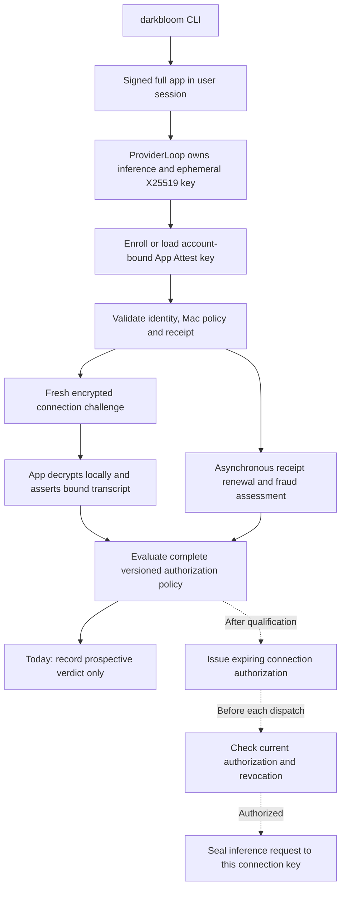

# Retiring APNs and MDM through App Attest

> Last updated: 2026-09-14 · commit `2f39698d2`

Status: **In progress** — 2026-09-14 — shadow recovery and prospective policy are implemented in the 0.9.4 candidate; [qualification and retirement gates](../operations/app-attest-rollout.md) remain distinct from enforcement/removal.

Use App Attest as the basis for a new provider authorization policy, while the
[coexistence release](app-attest-migration.md) keeps APNs and MDM authoritative.
The next milestone is a complete prospective policy verdict in shadow mode,
followed by physical Mac validation. A valid signature alone is insufficient
evidence for deleting the old system.

## Decision and evidence boundary

Apple explicitly includes macOS 27 in
[WWDC26 session 201](https://developer.apple.com/videos/play/wwdc2026/201/).
Its [server validation contract](https://developer.apple.com/documentation/devicecheck/validating-apps-that-connect-to-your-server)
provides the exact Mac key-access policy required for SIP and Full Security.
This is the basis for replacing the posture proof as well as the APNs code
challenge, subject to the live-key tests below.

The same contract uses the macOS signing identifier in the relying-party
identity and carries launch-category and bundle-version metadata. It does not
document a device serial, certified RAM inventory, or an exported executable
CDHash measurement. The CDhash opt-in entitlement must not be interpreted as
an additional server-visible measurement without evidence.

App identity, app-signed hardware/model claims, and correct inference are
different assurances. The existing [encryption model](../architecture/security/encryption.md)
continues to apply; App Attest does not move inference into the Secure Enclave.
The [specification audit](../reports/2026-09-14-app-attest-spec-review.md)
records current implementation gaps and discrepancies in Apple's examples.

## Proposed runtime and authorization flow

Preserve the CLI commands. Run App Attest, decryption, and inference inside
the same signed app process; local CLI control must never accept arbitrary
digests or endpoint keys for signing. First qualify the existing AppKit/user
LaunchAgent path. If it is ineligible, change the launcher to start the full
app through LaunchServices and use authenticated, narrow local control.
An AppKit run loop or an app-shaped directory by itself is not acceptance.
[Apple's engineering clarification](https://developer.apple.com/forums/thread/836329)
limits support to full apps in a user context; a daemon before user login is
not a supported substitute.

Seal executable code, helper code, libraries, and Metal resources into the
release bundle. Preserve Hardened Runtime and audit the final extracted
entitlements for debugger and library-loading exceptions. The model cache
remains outside the bundle; validate its manifests and hashes under a separate
model policy. Register immutable build identities in the coordinator's
approved-release catalog and verify the actual signed artifact against them.

## Three independent lifetimes

| Object | Proposed ownership and lifetime |
|---|---|
| Provider registration | Server-issued stable identifier under the authenticated account. Survives approved app-key rotations; carries account history and explicit revocation. |
| App Attest credential | Bound to one account, provider registration, app identity, and environment. Stores verified evidence, public key, counter, receipt, and lifecycle state. Multiple credentials can overlap during controlled rotation. |
| Serving connection | Own ephemeral X25519 endpoint and server connection identifier. A bounded authorization expires and is renewed through fresh assertions. Never restore authorization from a persisted credential alone. |

Bind assertions to a versioned canonical transcript containing the server
authority, authenticated account and registration, credential, connection,
environment, nonce, endpoint public key, and policy generation. Bind canonical
provider status/model claims where the replacement policy depends on them.
The serving app derives these local claims and its endpoint internally.
The server checks them against its own connection and authenticated state.

Use an encrypted challenge to demonstrate custody of that endpoint before
authorizing it. Atomic counters and one-time challenges apply across all
coordinator instances. Logout, account transfer, key replacement, reconnect,
and coordinator restart cannot silently carry authorization into a new scope.

At enforcement, centralize the final check wherever a new inference request
can be dispatched or re-sealed. Expiry, credential revocation, policy changes,
and connection replacement stop further dispatch immediately; they cannot
recall plaintext already delivered. Exercise queued work, retries, direct
routing, and reconnect paths. Do not set legacy MDA/APNs flags to true to make
existing gates pass. Lease duration and renewal margin require measured Mac
latency and security-transition evidence before becoming release constants.

## Enrollment, receipts, and recovery

Create a durable, expiring enrollment transaction before asking the app to
call Apple. Bind it to the account, credential, challenge, and environment;
make acceptance and acknowledgement idempotent. Retain an in-flight proof in
app memory until acknowledgement; reconcile the server record after a lost
acknowledgement. Do not persist the attestation object in the app. If the
process dies before server acceptance, perform a bounded, explicit recovery
instead of silently creating credentials on every reconnect.

Scope the local key record by authenticated account, authority, and
environment. Never repurpose another account's key. Schedule enrollment and
retry budgets from the coordinator, with aggregate limits across instances,
backoff, jitter, and cancellation. Bound the outstanding Apple operation as
well as its result delivery. Apple's
[client guidance](https://developer.apple.com/documentation/devicecheck/establishing-your-app-s-integrity)
distinguishes retrying an unavailable service with the existing key from
recovering other attestation errors; implement and test those state transitions.

Independently validate and save each receipt at enrollment. The
[receipt contract](https://developer.apple.com/documentation/devicecheck/assessing-fraud-risk)
uses Apple Root CA G3 for its signing chain, separately from the App Attest
credential root. Verify receipt identity, key, challenge binding, and creation
time. Keep raw evidence in access-controlled durable storage, outside logs.
Renew after its not-before time and before expiry, with an asynchronous job.

Use the DeviceCheck-authorized server key for fraud requests. That server
credential can remain after deleting the APNs push channel. Normal connection
assertions do not require an Apple server round trip. Treat delayed fraud
responses as an explicit unknown state under a bounded policy, not a zero
risk score or an automatic loss of existing legacy trust during shadow mode.

## A complete shadow verdict

Record independent results for credential validity, expected app/environment,
Mac access policy, approved build and launch category, current assertion,
endpoint custody, receipt verification, fraud freshness, and revocation.
Evaluate the exact proposed future policy against those results and record
`eligible`, `ineligible`, or `unknown`, with reasons and a policy version.
These are proposed outcomes, not current wire enums.

For the Developer ID distribution, the proposed build policy requires the
expected category and an allowed immutable build. Comparing a version to the
same client's registration is insufficient. Missing metadata remains unknown
until a verified platform-specific rule exists. Never allow an iOS fixture,
an alternate root, or a guessed field alias to pass a Mac production policy.

Use distinct connected provider cohorts as the denominator. Separate first
enrollment, reused credentials, fresh connections, and sustained renewal;
include unsupported, unconfigured, disconnected, timeout, rejected, and
dropped observations. Measure latency and reasons against contemporaneous
legacy decisions. Shadow verdicts cannot change serving, trust, or rewards.

## Provider identity and rewards after MDM

Preserve historical balances and provider/account records. During coexistence,
record a migration association only when both legacy and App Attest proofs
belong to the same authenticated registration and current endpoint. A new
App Attest key must never create a new reward-bearing physical-device identity.

Apple's fraud metric counts attested keys associated with a device over a
recent period; reinstall and recovery can increase it. It is useful for abuse
detection but does not give Darkbloom an immutable physical identifier.
Therefore the proposed default is to retain existing accounting identities,
cap new-registration subsidies by account with probation and abuse review,
and pay metered work under the existing work-accounting rules. Move static
hardware model limits out of the MDM package; keep the provenance of observed
and claimed hardware explicit. Performance challenges test useful capacity,
not physical uniqueness.

If base rewards must retain a strict one-physical-Mac guarantee or certified
RAM tier, App Attest alone does not establish equivalent evidence. Resolve
that product/security requirement before removing MDM; do not silently replace
it with a key ID or an app-reported serial.

## Delivery sequence and gates

| Stage | Concrete deliverable and acceptance |
|---|---|
| 1. Complete the shadow evidence | Correct parser compatibility; durable enrollment/acknowledgement; account-scoped keys; verified receipt storage; approved-build verdict; explicit prospective policy outcomes. APNs and MDM remain authoritative. |
| 2. Qualify the signed Mac app | Use the final Developer ID bundle/profile on physical macOS 27. Verify full enrollment, receipt, assertion, and encrypted inference; capture sanitized real fixtures with provenance. Also test the new bundle's APNs/MDM, install, and update paths on supported older macOS. |
| 3. Exercise hostile and recovery paths | Wrong team, re-signing, unapproved build, altered code/resources, substituted endpoint, replay, concurrent connections, key/Keychain loss, account change, interrupted enrollment, server restart, app update, sleep, and reboot. |
| 4. Prove security-transition behavior | Enroll with SIP and Full Security, change each setting on a designated test Mac, reboot, then attempt an assertion with the previously accepted key. An old certificate cannot exempt the new session. Test fresh enrollment under the reduced posture too. |
| 5. Enforce for qualified cohorts | Implement the shared dispatch authorization check, explicit revocation and rollback, plus accounting migration. Set measured coverage/error/latency gates and an older-OS eligibility policy. Supported API presence or aggregate success alone cannot promote the fleet. |
| 6. Retire dependencies | After sustained enforcement, separately remove APNs code/challenges and MDM/MDA paths, update enrollment/UI/docs, preserve required historical data, and retire live credentials/services and profiles through specifically approved operations. |

## Implementation map

These are the current code anchors for the proposed follow-ups, not claims
that the design above is implemented.

| Concern | Current code |
|---|---|
| Strict proof parsing | `coordinator/appattest/verify.go` (`Verifier.Attestation`, `Verifier.Assertion`); `authenticator.go` (`authData`, `validationCategory`) |
| Enrollment and prospective policy | `coordinator/api/app_attest_shadow_exchange.go` (`appAttestShadowSession.handle`); `app_attest_shadow_observation.go` (`observe`) |
| Durable credential lifecycle | `coordinator/store/app_attest_shadow.go` (`AppAttestShadowStore`); optional backend interfaces must use `store.As` |
| App lifecycle and account scope | `provider-swift/Sources/ProviderAppAttest/AppAttestShadowClient.swift` (`respond`); `ProviderCore/ProviderLoop+AppAttestShadow.swift` (`handleAppAttestShadow`) |
| Shared transcript | `coordinator/protocol/app_attest_shadow.go` (`AppAttestShadowHash`); `provider-swift/Sources/ProviderAppAttest/ShadowProtocol.swift` (`AppAttestShadowPayload.clientHash`) |
| Packaging and update acceptance | `.github/workflows/release-swift.yml`; `scripts/entitlements.plist`; `scripts/prepare-app-attest-entitlements.py`; `scripts/install.sh` |
| Accounting continuity | `coordinator/registry/persistence.go` (`persistProviderNow`); `coordinator/payments/baserewards/engine.go` |

See [current shadow behavior](../reference/app-attest-shadow.md) for the
implemented protocol and its limits.
